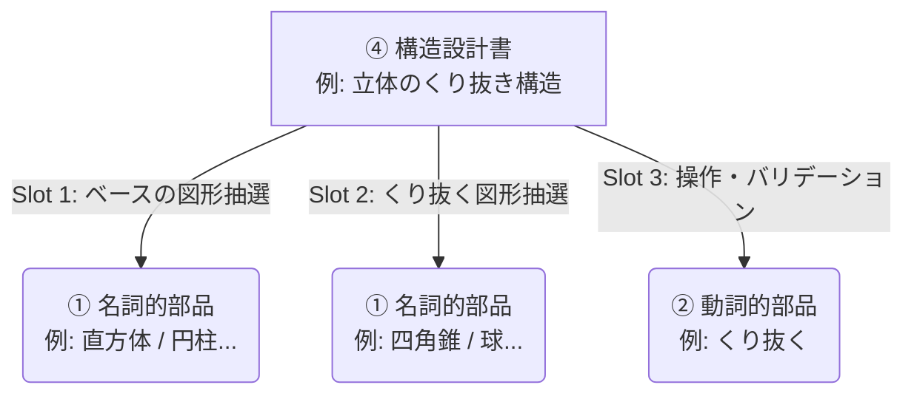
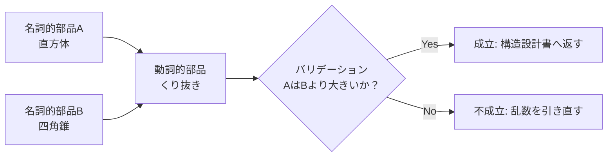
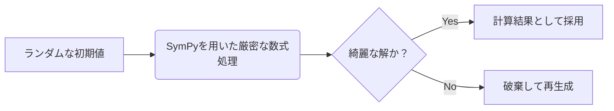
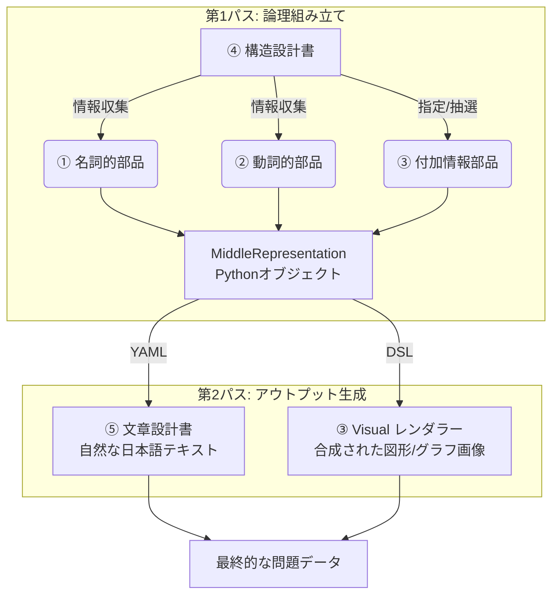

# 新アーキテクチャ詳細設計書 v1.0（自律実行用統合版）

本ドキュメントは、実質無限の問題生成を可能にするアーキテクチャ再設計の**完全な詳細設計書**である。
このファイル単体で Opus/Sonnet による**自律実装が可能**となるよう、以下のすべてを内包する：

- 思想・アーキテクチャ（§1〜§11）
- ソフトウェア詳細仕様（§12、重複排除を含む §12.6）
- 運用要件（§13）
- 品質保証・ガバナンス（§14）
- **実装フェーズ計画・自走プロトコル（§15）**
- **マスターデータ参照仕様（§16）**
- **Atom/Verb/Blueprint/Visual カタログ（§17）**
- **各部品の詳細スキーマ（§18）**
- **カバレッジ検証レポート（§19）**
- **MVP 外項目（Future Work）（§20）**
- **LLM 自動生成プロンプトテンプレート集（§21）**
- **完全実装サンプル（§22）**
- **プロジェクト構造とセットアップ（§23）**
- **全 177 lesson の y_base 推論ルール（§24）**
- **文章題シナリオバンク（§25）**
- **証明問題の出力構造（§26）**
- **入試レベル小問構成戦略（§27）**
- **マッピング教師データ仕様（§28）**
- **本番運用 LLM 翻訳プロンプト（§29）**
- **例外クラス定義（§30）**
- **Pydantic API モデル（§31）**
- **CI 環境（§32）**
- **数式 LaTeX 規約（§33）**
- **テスト assertion パターン（§34）**
- **その他追加仕様（§35）**
- **バリエーション保証の見積もり（§36）**
- **Blueprint runner メインループ実装（§37）**
- **Atom 抽選アルゴリズムとカタログ参照（§38）**
- **target_difficulty と y_base の調整（§39）**
- **Gemini API 統合の具体実装（§40）**
- **phase_status.md スキーマと Phase 1 起動チェックリスト（§41）**
- **バックグラウンド非同期生成（§42）**

### 凡例
- 🔴 **MVP 必須**
- 🟡 **MVP 推奨（Phase 6 で実装）**
- ⚪ **MVP 外（§20 Future Work）**

---

## 1. 全体アーキテクチャの定義（5層構造）🔴

問題を構成する要素を明確に責務分割した「5層アーキテクチャ」を定義する。この用語と責務の分離が、無限生成と自然な問題出力を両立させる土台となる。

| 要素（レイヤー） | 概要と責務 | 具体例 |
| :--- | :--- | :--- |
| **① 名詞的部品**<br>(Noun Atom) | 【責務】公式的計算式・数値計算<br>特定の概念や図形の公式とパラメータを保持する。 | 直方体の計算式、<br>$y=ax^2+bx+c$ の計算、<br>三平方の定理の計算 |
| **② 動詞的部品**<br>(Verb Atom) | 【責務】公式の組み合わせ・**不正問題の枝切り（バリデーション）**<br>名詞的部品同士の関係性を計算し、成立しないパターン（はみ出す等）を弾く。 | 図形のくり抜き、<br>2つの関数の間の面積 |
| **③ 付加情報部品**<br>(Visual Component) | 【責務】視覚情報の描画・提示形式の決定<br>問題に必要な図形、グラフ、統計表などの「表示形式（プログラム）」を持ち、構造設計書内で指定・抽選される。 | 空間図形の描画コンポーネント、<br>円グラフ描画コンポーネント、<br>度数分布表コンポーネント |
| **④ 構造設計書**<br>(Structural Blueprint) | 【責務】問題の構造的成立<br>名詞・動詞・付加情報の各種部品をタグ等で抽選・結合し、問題の骨格（中間表現データ）を組み上げる。 | 「図形Aから図形Bをくり抜き、体積を求める」という関係構造の定義 |
| **⑤ 文章設計書**<br>(Text Blueprint) | 【責務】自然な日本語への翻訳<br>構造設計書が出力した中間表現データを受け取り、入試問題のような自然な日本語テキストに変換する。 | 「図のような直方体の中に〜」という問題文テキストの生成 |

---

## 2. 無限に生成できる仕組み（レゴブロック式組み合わせ）🔴

### 2.1 アーキテクチャの新方針



### 2.2 無限生成（爆発的増加）のメカニズム
名詞 10×名詞 10×動詞 3 = 300 種類の組み合わせが 1 つの Blueprint から生まれる。新 Noun を 1 個追加するだけで全体が指数関数的に増加する。

---

## 3. 不正問題の枝切り（バリデーション）の仕組み 🔴



枝切りは **② 動詞的部品** の責務。`validate(*nouns) -> Tuple[bool, Optional[str]]` で失敗理由も返す（§12.1 参照）。

---

## 4. 数値計算の担保（SymPy 厳密計算）🔴



- **SymPy で平方根・π を含む厳密計算**を保つ
- 「綺麗な解」フィルタの形式的定義は §12.3 参照

---

## 5. 難易度の担保とトップダウン生成（麻雀の「飜と符」モデル）🔴

### 5.1 基礎難易度 $y$ と調整 $\delta$

**【基礎難易度 $y$】**
- 単元難易度（足し算=1、三平方=3 等）
- 複合単元ボーナス（+1〜+2）
- 問題形式（計算=0、文章題=+1、証明=+2）

**【調整難易度 $\delta$（多次元、±15 程度）】**
- `unit_mix_bonus`: 複合単元ボーナス（+2 / 単元追加）
- `digit_penalty`: 計算桁数（+1 / 3桁以上）
- `hint_reduction`: 提示情報削減（-2 / 図あり, +3 / 文章のみ）
- `step_depth`: 演算ステップ深さ（+1 / 1手増）

### 5.2 UX 制御フロー

ユーザー指定 $x$ と基礎 $y$ の差分 $\delta = x - y$ をシステムが Blueprint で埋める。

---

## 6. 未習熟単元の確実な排除（教師宣言ベース）🔴

### 6.1 タグベースのハード制約

生徒個別ではなく、**教師が「このクラスは三平方をまだ習っていない」と宣言**することで成立する制約。生徒解答履歴に基づく自動推定（IRT/BKT）は MVP 外（§20）。

1. **入力の `unlearned_tags` 受領**: 教師が UI 経由で宣言（例: `["pythagorean", "quadratic_equation"]`）
2. **Blueprint の除外**: `requires` タグが衝突する Blueprint を候補から除外
3. **Atom の抽選除外**: 該当タグを持つ Atom を抽選プールから事前フィルタ
4. **前提単元グラフによる連鎖排除**: `unlearned_tags` で示された単元を前提とする他の単元も自動排除（前提グラフは §16 参照）

これにより「中3 の生徒だが、まだ三平方をやっていない」状態の問題集を確実に編纂できる。

---

## 7. 問題生成と出力の2パス・パイプライン（実行フロー）🔴

### 第1パス：論理組み立て
1. ④ Blueprint が 目標難易度に応じて ① Noun, ② Verb, ③ Visual を抽選・組合せ
2. SymPy で計算と Verb によるバリデーション
3. **中間表現 (MiddleRepresentation)** が完成（§12.1）

### 第2パス：アウトプット生成
- **⑤ 文章設計書**: 中間表現を YAML 化 → LLM 翻訳で自然な日本語に
- **③ Visual レンダラー**: 描画 DSL を SVG/PNG 化



---

## 8. ⑤ 文章設計書（LLM による自然な日本語の生成）🔴

### 8.1 LLM 受け渡しフォーマット
中間表現を **YAML / Markdown 構造化テキスト** に変換して LLM プロンプトへ。

```yaml
問題形式: 文章題
ベース図形:
  種類: 直方体
  パラメータ: 縦=3cm, 横=4cm, 高さ=5cm
操作:
  種類: くり抜き
  対象: 底面の中央から、底面が1辺1cmの正方形で高さが5cmの四角柱
求めるもの:
  - (1) くり抜かれた残りの立体の体積
  - (2) くり抜かれた残りの立体の表面積
```

### 8.2 LLM は翻訳のみ
- 数学的正しさは SymPy が保証済
- LLM は装飾（自然な日本語化）に専念
- **計算間違いやハルシネーションを構造的に防止**

### 8.3 コンテキスト注入（高度プロンプトビルダー）
1. **Few-Shot Prompting**（固定シードコーパスから動的注入。動的ベクトル検索は §20）
2. **数学固有スタイルガイド**（「求めなさい」、「右の図のように」、π の使用など）
3. **解説のステップバイステップ誘導**（Verb の LogicStep を順序通り渡す）

### 8.4 モデルティアリング（Z-3）🔴

**重要：2026年4月以降、Gemini 2.5 Pro および 3 Pro は無料枠から廃止**された（paid のみ）。本設計は Flash 系列のみで完結する形に再設計する。

| 問題タイプ | 使用モデル | RPD | TPM | 思考モード |
|:---|:---|:---|:---|:---|
| 単純計算（中1 四則・方程式、文章題基礎）| **Gemini 3.1 Flash-Lite** | 1,000 | 250K | low |
| 文章題・図形（中2〜中3 標準、確率、関数）| **Gemini 3 Flash** | 1,500 | 250K | medium |
| 入試融合・証明・規則性・複雑な解説 | **Gemini 3 Flash** | 1,500 | 250K | **high（thinking mode）** |

**配分目安**（モデル別の使い分け）：
- 中1 計算系: 約 40% → Flash-Lite で十分（軽量・高速）
- 中2〜中3 標準: 約 50% → Flash（medium thinking）
- 入試難問・証明: 約 10% → Flash（high thinking）

**無料枠で生成可能な月産量**：
- Flash 1,500 RPD × 30 日 = **45,000 問/月**（理論上限）
- Flash-Lite 1,000 RPD × 30 日 = 30,000 問/月（追加で同時利用可能）
- 実効値：問題集数十冊分（1 冊 200-300 問換算）

**フォールバック戦略**：
- Flash がエラーまたはレート上限 → Flash-Lite に自動切替
- Flash-Lite も上限 → Gemini 2.5 Flash（旧モデル、1,500 RPD で生存）

**API キー設定**：
- 環境変数 `GEMINI_API_KEY` に Google AI Studio 取得のキーを設定
- 取得 URL: https://aistudio.google.com/app/apikey
- クレジットカード不要、無期限

---

## 9. システムの入出力インターフェース（I/O と UX 設計）🔴

### 9.1 入力スキーマ（Input）
```json
{
  "curriculum": {
    "grade": 3,
    "domain": "図形",
    "large_unit": "三平方の定理",
    "lesson_ids": ["g3_l55"]
  },
  "problem_form": "word_problem",
  "target_difficulty": 85,
  "unlearned_lesson_ids": ["g3_l24"]
}
```

**フィールド説明**:
- `grade`: 整数 1〜3（中学1年〜中学3年）
- `lesson_ids`: 単元の lesson_id 配列（§11.1 の `g{n}_l{m}` 形式）。複数指定可（複合単元問題）
- `unlearned_lesson_ids`: 教師が宣言する「このクラスはまだ習っていない単元」の lesson_id 配列。前提グラフを通じて連鎖排除される

**改善ポイント**：
- 乱数シードは隠蔽（バックエンドで自動生成、メタデータには保存）
- 難易度を 1〜100 の高解像度に
- 単元は学習指導要領の階層（domain → large_unit → lesson_number）で指定

### 9.2 出力スキーマ（Output）
```json
{
  "content": {
    "problem_text": "右の図のような...",
    "answer": {
      "type": "numeric",
      "sympy_form": "30",
      "text_form": "30 cm³"
    },
    "explanation_text": "(1) まず直方体の体積を求めます..."
  },
  "visuals": {
    "problem_diagram_url": "https://.../diagram_123.svg",
    "explanation_diagram_url": null
  },
  "metadata": {
    "base_difficulty": 88,
    "adjustment_delta": -3,
    "used_atoms": ["cuboid_1", "pyramid_1", "cutout_operation"],
    "seed": 4823,
    "blueprint_id": "BasicDifferenceStructure",
    "blueprint_version": "v1",
    "model_used": "gemini-3-flash"
  }
}
```

---

## 10. 複合単元の扱いと Blueprint 爆発の回避 🔴

### 10.1 前提単元グラフによる依存解決
- `三平方の定理` → `平方根` → `数と式` → `四則演算` のグラフを保持
- 重複する前提単元は除去して Target Tags に正規化

### 10.2 構造ベースの抽象 Blueprint とタグの「満たし合い」
- Blueprint は **「数学的構造ベース」**（差分・交差・規則性等）で作成
- **タグの required_tags（必須被覆）と optional_tags（可能なら被覆）を区別**
- Atom の Tag Union が Required を完全被覆すれば成立

---

## 11. 単元定義と生成ロジックの完全分離（マッピングレイヤー）🔴

### 11.1 マッピングレイヤーの構造

**lesson_id 正規仕様（必ず遵守）**:
- 形式: `"g{grade}_l{lesson_number}"` （例: `g3_l19` = 中3 lesson 19）
- grade: 1, 2, 3 のいずれか（中1=1、中2=2、中3=3）
- lesson_number: 1〜60 の整数（各学年内で一意）
- すべての参照箇所（mapping.json / prerequisite_graph.yaml / few_shot_seeds / API 入出力）でこの形式を使う

```json
{
  "target_lesson_id": "g3_l19",
  "execute_blueprint": "BasicCalculationStructure",
  "required_tags": ["square_root"],
  "optional_tags": ["fraction"],
  "atom_constraints": {
    "SquareRootAtom": {
      "force_denominator_root": true,
      "allow_simplification": true
    }
  }
}
```

### 11.2 疎結合の利点
- **Atom の純粋性**: 「分母にルートを残す」という数学的振る舞いのみ知る
- **カリキュラム改訂耐性**: マッピング JSON のみ修正で対応

---

## 12. ソフトウェア詳細設計仕様 🔴

### 12.1 データモデルとインターフェース仕様

```python
from abc import ABC, abstractmethod
from dataclasses import dataclass, field
from typing import List, Dict, Tuple, Optional, Literal, Union, ClassVar, Any
import sympy
import random

@dataclass
class LogicStep:
    operation_name: str             # 例: "theorem_pythagoras"
    operands: List[str]             # 例: ["side_a", "side_b"]
    sympy_expr: sympy.Expr          # 計算結果式
    narration_hint: str             # 例: "三平方の定理より"

@dataclass
class VisualDSL:
    render_type: str                # 例: "2D_Geometry", "3D_Wireframe"
    elements: List[Dict]            # 座標・線・形状
    viewport: Tuple[float, float, float, float]

@dataclass
class AnswerObject:
    type: Literal["numeric", "expression", "proof", "set", "graph"]
    sympy_form: Optional[sympy.Expr]
    text_form: str
    extras: Dict[str, Any] = field(default_factory=dict)

@dataclass
class SubQuestion:
    label: str                      # "(1)", "(2)"
    prompt_hint: str
    logic_steps: List[LogicStep]
    answer: AnswerObject
    depends_on: List[str] = field(default_factory=list)  # 例: ["(1)"]

@dataclass
class MiddleRepresentation:
    problem_structure_type: str     # 例: "BasicDifferenceStructure"
    selected_tags: List[str]
    difficulty_score: float
    problem_form: Literal["word_problem", "calculation", "proof"]
    sub_questions: List[SubQuestion]
    visual_dsl: Optional[VisualDSL]
    seed: int
    blueprint_id: str
    blueprint_version: str

@dataclass
class AtomConstraints:
    difficulty_band: Tuple[int, int]
    forbidden_tags: List[str]
    seed: int
    custom: Dict[str, Any] = field(default_factory=dict)

class NounAtom(ABC):
    tags: ClassVar[List[str]] = []
    @abstractmethod
    def sample(self, constraints: AtomConstraints, rng: random.Random) -> 'NounAtom': ...
    @abstractmethod
    def get_symbols(self) -> Dict[str, sympy.Expr]: ...

class VerbAtom(ABC):
    arity: ClassVar[Union[int, Literal["n-ary"]]] = 2
    accepted_noun_types: ClassVar[List[str]] = []
    @abstractmethod
    def validate(self, *nouns: NounAtom) -> Tuple[bool, Optional[str]]: ...
    @abstractmethod
    def solve(self, *nouns: NounAtom, rng: random.Random) -> LogicStep: ...

@dataclass
class VisualSlot:
    component_type: str             # 例: "3D_Renderer"
    compatible_noun_types: List[str]
    required: bool

class VisualComponent(ABC):
    @abstractmethod
    def render(self, dsl: VisualDSL) -> str: ...  # SVG 文字列 or 画像パス

@dataclass
class NounSlot:
    """Blueprint 内の Noun スロット定義。マッピング層から制約が注入される"""
    slot_name: str                              # 例: "base_solid"
    accepted_tags: List[str]                    # 例: ["space_geometry"]
    accepted_noun_types: List[str] = field(default_factory=list)  # 例: ["PrismAtom"]、空なら全許可
    required: bool = True                       # False なら省略可能
    constraints_override: Dict[str, Any] = field(default_factory=dict)  # マッピング層が追記

@dataclass
class StoryContext:
    """文章題のシナリオ情報。WordProblemStructure 用"""
    scenario_id: str                            # 例: "speed_walking_to_school"
    characters: List[str]                       # 例: ["太郎", "花子"]
    setting: str                                # 例: "家から学校までの通学"
    units: Dict[str, str]                       # 例: {"distance": "km", "time": "分"}
    narrative_hint: str                         # 例: "毎朝同じ時刻に出発する"

@dataclass
class VerbInvocation:
    verb: VerbAtom
    input_slots: List[str]
    output_slot: str
    on_failure: Literal["retry_seed", "fallback_atom", "abort"] = "retry_seed"
    # retry_seed: seed を変えて全体を再試行
    # fallback_atom: この slot だけ別 Atom に差し替えて再試行
    # abort: この Blueprint を放棄

@dataclass
class BlueprintDefinition:
    blueprint_id: str
    blueprint_version: str
    noun_slots: Dict[str, NounSlot]
    verb_invocations: List[VerbInvocation]
    visual_slot: Optional[VisualSlot]
    supported_forms: List[Literal["word_problem", "calculation", "proof"]]
    story_required: bool = False                # word_problem 時に StoryContext が必須か
    base_difficulty_calculator: 'BaseDifficultyCalc'  # 下記参照
    subquestion_strategy: Optional['SubQuestionStrategy'] = None  # §27 参照

# base_difficulty_calculator のシグネチャ（厳密に固定）
BaseDifficultyCalc = Callable[
    [Dict[str, NounAtom], Dict[str, Any]],   # (sampled_nouns, atom_constraints)
    int                                       # y_base (1-100)
]
# 例: lambda nouns, ctx: 76  # 三平方空間図形利用
# 通常は §24 の compute_y_base() を呼び出すだけ
```

**統一規約（API・データ形式の grade 表現）**:
- **数値形式**: `grade: 1 | 2 | 3`（API 入力・マッピング JSON・前提グラフすべて）
- 文字列の `"中学1年"` や `"JHS_1"` は使わない（curriculum_math.json のみ例外：MEXT 表記準拠で `"中学1年"` を保持）
- 内部変換: `JHS_GRADE_LABEL = {1: "中学1年", 2: "中学2年", 3: "中学3年"}` を `apps/api/src/core/constants.py` に定義

### 12.2 Verb Atom の分類学と責務境界

5 分類（計 20 Verb）：
1. **ArithmeticVerb**: `CalculateArithmeticVerb`
2. **LogicVerb**: `SolveEqVerb`, `ProveGeometryVerb`, `ProveAlgebraicVerb`, `SolveLinearDiophantineVerb`
3. **GeometryVerb**: `CutoutVerb`, `SliceSolidVerb`, `TransformShapeVerb`, `UnfoldNetVerb`, `ConstructGeometryVerb`, `LocusVerb`, `FindAngleVerb`, `MeasureGeometryVerb`, `FormShapeVerb`, `IntersectVerb`
4. **DataProbabilityVerb**: `CalculateProbabilityVerb`, `AnalyzeDataVerb`, `EstimatePopulationVerb`
5. **SequenceVerb**: `GeneralizeFormulaVerb`, `FindDivisorsVerb`

#### Verb–Noun 型互換マトリクス
| Verb | 許容 Noun |
|:---|:---|
| `SolveEqVerb` | `EquationAtom`, `ProportionAtom` |
| `CutoutVerb` | `PrismAtom`, `PyramidAtom`, `SphereAtom`, `PolygonAtom`（2D） |
| `TransformShapeVerb` | `PolygonAtom`, `PrismAtom`, `LinearFuncAtom` |
| `IntersectVerb` | `LinearFuncAtom`, `QuadraticFuncAtom`, `PolygonAtom` |
| `FindAngleVerb` | `LineAngleAtom`, `CircleAngleAtom`, `PolygonAtom` |
| `LocusVerb` | `PointAtom`, `PolygonAtom`, `CircleAtom` |
| `GeneralizeFormulaVerb` | `SequenceAtom` |
| `FindDivisorsVerb` | `NumberAtom` |
| `SolveLinearDiophantineVerb` | `EquationAtom` |

#### 責務境界
- **Noun**: 自身の数式・パラメータを保持（計算しない）
- **Verb**: Noun のパラメータを組み合わせて方程式を立て、解く。「はみ出しチェック」もここ
- **Visual Component**: レイアウト・描画のみ（数学的検証なし）

### 12.3 「綺麗な解」と失敗時挙動

**【綺麗な解 (is_clean) の形式的定義 - グローバルデフォルト】**
- 分数：分母が 3 桁以下
- 根号：因数分解された最小形、中身が 1000 以下
- 許可されない無理数（中学範囲外）を含まない
- 証明：論理ステップ数 10 手以下

**【lesson 別オーバーライド】**（C-2）
- mapping.json の各エントリで `is_clean_override` を指定可能
- 例：`g3_l21 平方根のいろいろな計算` では分母 5 桁 / 根号中 10000 まで許容
- Blueprint runner がマッピングを読み込んでオーバーライド値で `is_clean()` を呼ぶ

**【リトライ・フォールバック】**
1. `Verb.validate()` または `is_clean()` で NG → **Blueprint 毎に設定可能（デフォルト 50 回、複雑幾何は 200 回）** で再抽選
2. 規定回数で失敗 → 別 Noun に **fallback_atom**（§12.1 `VerbInvocation.on_failure` 参照）
3. それでも失敗 → 別 Blueprint に切替（マッピング層の `fallback_blueprints` を参照）
4. すべて失敗 → `CleanSolutionExhaustedError`（§30）

**【LLM 翻訳の決定論的検証 + 多段フォールバック】**
1. **Tier 1** (`gemini-3-flash`, thinking: medium) で翻訳
2. 検証: `extracted_text → regex で数式抽出 → sympy.simplify(extracted - answer_sympy) == 0`
3. 不一致なら **Tier 1** で最大 3 回リトライ
4. 3 回失敗時：**Tier 2** (`gemini-3-flash`, thinking: high) へエスカレート、再度 3 回試行
5. それでも失敗：**Tier 3** (`gemini-2.5-flash`) へフォールバック
6. それでも失敗：§35.4 のテンプレ展開（機械的日本語化、low_quality_translation: true をログ記録）

### 12.4 難易度モデルの多次元ペナルティ仕様

$$\text{Total Difficulty} = y_{\text{base}} + \sum \delta_{\text{factors}}$$

δ ファクター群：
- `unit_mix_bonus`: +2 / 単元追加
- `digit_penalty`: +1 / 3桁以上の計算
- `hint_reduction`: -2 / 図あり、+3 / 文章のみ
- `step_depth`: +1 / 1手増ごと
- `proof_complexity`: +3 / 証明問題
- `multipart_subquestions`: -1 / 小問追加

MVP では重みは固定値。IRT 後学習は §20 Future Work。

### 12.6 問題重複排除機構 🔴

「同じ Blueprint + 同じ難易度 + 同じ lesson」で 100 問生成しても重複が起きないよう、以下を実装する。

**ハッシュキャッシュ（SQLite）**:
```python
# apps/api/src/core/dedup/hash_cache.py
import hashlib
import sqlite3
from pathlib import Path

class DuplicationGuard:
    def __init__(self, db_path: str = "master_data/cache/dedup.db"):
        Path(db_path).parent.mkdir(parents=True, exist_ok=True)
        self.conn = sqlite3.connect(db_path)
        self.conn.execute("""
            CREATE TABLE IF NOT EXISTS generated_problems (
                hash TEXT PRIMARY KEY,
                lesson_id TEXT,
                blueprint_id TEXT,
                seed INTEGER,
                problem_text_preview TEXT,
                created_at TIMESTAMP DEFAULT CURRENT_TIMESTAMP
            )
        """)
        self.conn.commit()

    def compute_hash(self, mr: "MiddleRepresentation") -> str:
        """answer_sympy + 主要 sympy_expr の連結を SHA256 でハッシュ化"""
        components = [str(sq.answer.sympy_form) for sq in mr.sub_questions]
        components += [str(step.sympy_expr) for sq in mr.sub_questions for step in sq.logic_steps]
        return hashlib.sha256("|".join(components).encode()).hexdigest()

    def is_duplicate(self, mr: "MiddleRepresentation") -> bool:
        h = self.compute_hash(mr)
        row = self.conn.execute("SELECT 1 FROM generated_problems WHERE hash = ?", (h,)).fetchone()
        return row is not None

    def register(self, mr: "MiddleRepresentation", problem_text: str):
        h = self.compute_hash(mr)
        self.conn.execute(
            "INSERT OR IGNORE INTO generated_problems VALUES (?, ?, ?, ?, ?, CURRENT_TIMESTAMP)",
            (h, mr.blueprint_id, mr.blueprint_id, mr.seed, problem_text[:200])
        )
        self.conn.commit()
```

**Blueprint runner 内での運用**:
1. Atom 抽選 → Verb 検証 → SymPy 計算 → MiddleRepresentation 完成
2. **`DuplicationGuard.is_duplicate(mr)` をチェック**
3. 重複なら seed を変えて再抽選（リトライ回数にカウント）
4. 重複でなければ LLM 翻訳に進む
5. 翻訳成功後、`DuplicationGuard.register(mr, problem_text)`

**ハッシュの粒度**:
- 数値計算問題: `answer_sympy` 完全一致を重複と判定
- 文章題: `answer_sympy + 主要中間ステップ` で判定（言い回し違いは別問題と扱う）
- 証明問題: `logic_steps` の `operation_name` 列で判定

**運用上の挙動**:
- DB が空（初回）: 何も衝突しない
- 100 問生成後: 同じ Blueprint + Constraints のパラメータ空間が枯渇すると Rejection 多発 → ログで警告
- DB は問題集編纂単位でリセット可能（`--reset-dedup` フラグ）

### 12.6.1 セッション内の多様性ローテーション（C-11）

完全重複の排除に加え、**同じ Noun の連続使用を 3 回まで**に制限する：

```python
# apps/api/src/core/dedup/diversity_rotation.py
from collections import defaultdict

class DiversityRotation:
    """セッション内で同じ Noun が連続選択されるのを防ぐ"""
    def __init__(self, max_consecutive: int = 3):
        self.max_consecutive = max_consecutive
        self.recent_picks: Dict[str, int] = defaultdict(int)  # slot_name -> 連続選択回数

    def filter_candidates(self, slot_name: str, candidates: List[NounAtom], last_pick: Optional[str]) -> List[NounAtom]:
        if last_pick is None:
            return candidates
        # 直近 max_consecutive 回連続なら、その Noun を除外
        if self.recent_picks.get(slot_name, 0) >= self.max_consecutive:
            return [c for c in candidates if type(c).__name__ != last_pick]
        return candidates

    def record_pick(self, slot_name: str, atom_class_name: str, last_pick: Optional[str]):
        if atom_class_name == last_pick:
            self.recent_picks[slot_name] += 1
        else:
            self.recent_picks[slot_name] = 1
```

Blueprint runner はバッチ生成時にこの DiversityRotation を保持し、Atom 抽選時に `filter_candidates()` を介する。

### 12.5 評価指標と CI ゲート

| 指標 | 検証手段 |
|:---|:---|
| **Solvability** | SymPy がエラーなく解を出力（100% 必須） |
| **Accuracy** | LLM 出力テキスト → 数式逆抽出 → SymPy 照合（決定論的） |
| **Educational Appropriateness** | 禁止語彙リスト + N-gram マッチ（決定論的） |
| **Standards Alignment** | 学年範囲外単元（例：中1 に √）が出ていないかタグベース検証 |

---

## 13. 運用・インフラ要件 🔴

### 13.1 マッピング層の運用
- **JSON 作成者**: 教科担当（ドメインエキスパート）→ Phase 5 では LLM が自動生成
- **学習指導要領改訂**: マッピング JSON のみ書換、Atom コード凍結
- テナント別差異は §20 Future Work

### 13.2 観測可能性と LLM 運用
- **レイテンシ目標**: バックグラウンド非同期生成（30〜60 秒以内）
- **Few-Shot 注入**: 固定シードコーパス（教師手作り 50〜100 問）。動的ベクトル DB は §20
- **失敗ログ**: ログファイルに Rejection 率・失敗種別を記録。Datadog 等は §20
- **モデルティアリング**: §8.4 参照

### 13.3 前提単元グラフの構築
- K12-KGraph / LearnGraph 等の既存教育用ナレッジグラフをベースに、日本の学習指導要領に合わせて手動マッピング・微調整
- DAG として `master_data/prerequisite_graph.yaml` に格納（§16 参照）
- Phase 5 で LLM が学習指導要領（§16 で参照する `master_data/curriculum_math.json`）を読んで自動生成

---

## 14. 品質保証・ガバナンス要件 🔴

### 14.1 ガバナンス・安全性・バージョン管理
- **再現性**: 乱数シード値・LLM シード値・Git コミットハッシュをメタデータ保存
- **Atom バージョン管理**: 互換性破壊時は `v2` 継承クラス、過去マッピングは `v1` を指す
- **自己重複防止**: 自社生成履歴と N-gram 類似度比較。外部問題集との照合は §20

### 14.2 タグの網羅と多様性制御
- **Required vs Optional**: マッピング層で `required_tags`（必須被覆）と `optional_tags`（任意被覆）を分離
- **Realizability 検証**: 図形描画前に SymPy 解析的検証で「重なり・はみ出し」事前チェック
- 多様性メトリック（連続出題の類似度制御）は §20

### 14.3 Multi-Agent 検証の棄却
**LLM-as-Judge は採用しない**。理由：コスト・レイテンシ・ハルシネーションの連鎖。すべて決定論的アルゴリズムで保証する。

---

## 15. 実装フェーズ計画・自走プロトコル 🔴

### 15.1 自走の前提

本設計書 1 ファイル + `master_data/` ディレクトリ + `ignore_docs/unit/math-*.json` を新規ディレクトリにコピーして、以下を行う：

```bash
mkdir -p ~/new_workspace/mongene/{master_data,docs,apps/api/src}
cp implementation_plan.md ~/new_workspace/mongene/docs/
cp ignore_docs/unit/math-*.json ~/new_workspace/mongene/master_data/
cd ~/new_workspace/mongene
# Opus/Sonnet を起動し、以下のフェーズを順次実行
```

各フェーズは「ユーザー指示 = フェーズ名 1 つだけ」で完結する。

### 15.2 フェーズ進行プロトコル

各フェーズの完了条件は **自己検証可能** とする：
1. 指定の成果物ファイルが存在
2. ユニットテストが通る
3. `phase_status.md` に「Phase N: COMPLETED」と LLM 自身が記録

ユーザーは「Phase N 開始してください」だけ言えば、LLM が自律的に：
- 設計書を読み直し
- 必要なファイルを生成
- テストを走らせ
- コミットし
- `phase_status.md` 更新

### 15.3 コンテキスト管理プロトコル

LLM のコンテキストが 80% を超えそうな場合：
1. 現在の進捗を `phase_status.md` に詳細追記
2. コミット
3. ユーザーに「コンテキストリセットが必要。次のセッションで Phase N の続きから再開してください」と通知
4. ユーザーは新しいセッションで「Phase N の続きを実行してください」と入力するだけで再開可能

### 15.4 全 6 フェーズの定義

#### Phase 1: 骨格構築 + 垂直スライス
**ゴール**: §12.1 の全 ABC + MiddleRepresentation + Blueprint runner + 評価指標 CI が動く状態 + **最低限 1 個ずつの Noun/Verb/Visual/Blueprint で end-to-end が動く**

**成果物（基盤）**:
- `apps/api/src/core/abc/atoms.py`（NounAtom, VerbAtom ABC）
- `apps/api/src/core/abc/visuals.py`（VisualComponent ABC）
- `apps/api/src/core/abc/blueprint.py`（BlueprintDefinition, VerbInvocation）
- `apps/api/src/core/representation/middle_representation.py`
- `apps/api/src/core/runner/blueprint_runner.py`（リトライロジック含む）
- `apps/api/src/core/evaluation/{solvability,accuracy,appropriateness,standards}.py`
- `apps/api/src/core/llm/translator.py`（Gemini 統合、§8.4 モデルティアリング）
- `apps/api/src/core/dedup/hash_cache.py`（§12.6 重複排除）

**成果物（垂直スライス：最低限の実装）**:
- `apps/api/src/atoms/noun/number_atom.py`（NumberAtom の完全実装）
- `apps/api/src/atoms/verb/calculate_arithmetic_verb.py`（CalculateArithmeticVerb の完全実装）
- `apps/api/src/visuals/null_renderer.py`（描画なし問題用のスタブ）
- `apps/api/src/blueprints/basic_calculation.py`（BasicCalculationStructure の最低実装版）
- `tests/integration/test_hello_world.py`：「正の数・負の数の四則計算を 1 問生成 → SymPy で検算 → LLM 翻訳 → 重複チェック」が end-to-end で通る

**成果物（マスターデータ生成）**:
- `master_data/forbidden_words.txt`（基本的な禁止語彙、§21.4 のプロンプトで LLM 自動生成）

**自己検証**:
1. `pytest tests/core/` が全通過（90%+ カバレッジ）
2. `pytest tests/integration/test_hello_world.py` が通過（Hello World 問題が実際に LLM 翻訳まで完了）
3. `phase_status.md` に「Phase 1: COMPLETED」と所要時間・テスト結果を記録

**循環依存解消の根拠**: Phase 1 では「最も単純な NumberAtom + CalculateArithmeticVerb + NullRenderer + BasicCalculation 1 個」だけを先行実装。これは Phase 2 で本格的に拡張される（NumberAtom v2、CalculateArithmeticVerb v2 として）。骨格テストに必要な最低限のサンプルを Phase 1 で持つことで、骨格自体の検証が独立で完結する。

#### Phase 2: Atom / Verb / Visual カタログ全実装
**ゴール**: §17 にリストされた全 Noun Atom（約 21 個）+ 全 Verb Atom（約 17 個）+ 全 Visual Component（5 個）を実装
**成果物**:
- `apps/api/src/atoms/noun/{number,polynomial,square_root,equation,proportion,sequence,...}.py`
- `apps/api/src/atoms/verb/{arithmetic,solve_eq,cutout,...}.py`
- `apps/api/src/visuals/{three_d_renderer,two_d_geometry,graph,table_chart,tree}.py`
- 各 Atom に SymPy 計算 + Tags + Constraints 対応のコード
- `tests/atoms/` で各 Atom の sample() / get_symbols() / validate() / solve() がテストされる
**自己検証**: 全 Atom がユニットテスト通過

#### Phase 3: Blueprint カタログ全実装（11 個）
**ゴール**: §17 の 11 個の Blueprint をすべて実装
**成果物**:
- `apps/api/src/blueprints/{basic_calculation,word_problem,...,sequence_pattern}.py`
- 各 Blueprint が `BlueprintDefinition` 形式
- `tests/blueprints/` で各 Blueprint が end-to-end で MiddleRepresentation を生成
**自己検証**: 各 Blueprint で 10 問程度生成し Solvability + Accuracy が 100%

#### Phase 4: マスターデータ自動生成
**ゴール**: 177 件のマッピング JSON + 前提単元グラフ + Few-Shot シードコーパス + 文章題シナリオを生成
**成果物**:
- `master_data/mapping.json`（177 lesson 全カバー）
- `master_data/mapping_seed.json`（**Phase 開始前に人手で 20 件作成、§28 参照**）
- `master_data/prerequisite_graph.yaml`（lesson_id 間の DAG）
- `master_data/few_shot_seeds/*.yaml`（50〜100 問）
- `master_data/scenarios.yaml`（文章題シナリオ 15 件、§25 参照）
**生成方法**: LLM が `curriculum_math.json` + §17 カタログ + `mapping_seed.json` を読み、§21 のプロンプトを実行
**自己検証**（§28.3 verify_generated_mapping アルゴリズム）:
1. マッピングが全 177 lesson をカバー
2. DAG にサイクルなし（NetworkX で `is_directed_acyclic_graph` チェック）
3. **mapping_seed.json の全 20 件と execute_blueprint が一致**
4. **各 lesson で 1 問実生成し Solvability + Standards Alignment が通る**
5. **§36 のパラメータ空間見積もりで `estimated_unique_problems >= 10` を確認**
6. Few-Shot 例が SymPy で計算可能

#### Phase 5: 統合テストと品質ゲート
**ゴール**: §35.1 の選定基準に従い 1000 問生成し、CI 4 軸が通る
**成果物**:
- `scripts/run_full_coverage.py`（§35.1 のサンプリング実装）
- `tests/integration/test_full_coverage.py`
- `reports/coverage_report.md`（各 lesson の生成成功率、難易度の実測分布、Atom 採択率）
**自己検証**:
- Solvability 100%（必須）
- Accuracy 95%+（LLM 出力から数式逆抽出 → SymPy 照合）
- Educational Appropriateness 100%（禁止語彙ヒットゼロ）
- Standards Alignment 100%（学年範囲外単元なし）
- 重複率 < 1%（§12.6 DuplicationGuard で判定）

#### Phase 6: API + フロントエンド統合
**ゴール**: §35.2 の「ローカルで使えるレベル」を達成
**成果物**:
- `apps/api/src/domains/problems/router.py`（FastAPI、§31 Pydantic モデル使用）
- `apps/api/src/domains/teachers/router.py`（教師宣言の unlearned_lesson_ids 管理）
- `apps/api/main.py`（FastAPI エントリ + StaticFiles で `/diagrams/` マウント）
- `apps/api/templates/index.html`（Vanilla HTML + KaTeX CDN、§35.2 参照）
- `.github/workflows/test.yml`（§32 CI yaml）
**自己検証**:
- ローカル `uvicorn apps.api.main:app --reload` で起動
- `http://localhost:8000/docs` で Swagger UI 表示
- `POST /problems/generate` に §31 のリクエストを投げると §31 のレスポンスが返る
- `http://localhost:8000/` で HTML UI が表示され、入力 → 問題生成 → 結果表示が動く
- 図形問題で SVG が `http://localhost:8000/diagrams/{seed}.svg` で取得できる

### 15.5 フェーズ間の依存と並行可能性
- Phase 1 → 2 → 3 → 4 → 5 → 6 の順
- Phase 2 内では Noun / Verb / Visual は並行実装可
- Phase 3 の 11 Blueprint は並行実装可

---

## 16. マスターデータ参照仕様 🔴

### 16.1 マスターデータディレクトリ構成
```
master_data/
├── curriculum_math.json          ← 中1〜中3 の全 small_unit リスト（ignore_docs/unit/math-*.json を統合）
├── atoms.yaml                    ← §17.1, §18.1 から Phase 1 で生成（Atom メタ情報）
├── verbs.yaml                    ← §17.2, §18.2 から Phase 1 で生成
├── blueprints.yaml               ← §17.4 から Phase 1 で生成
├── visual_components.yaml        ← §17.3, §18.3 から Phase 1 で生成
├── scenarios.yaml                ← Phase 4 で LLM 生成（§25 文章題シナリオ）
├── mapping_seed.json             ← Phase 4 前に人手で 20 件作成（§28）
├── mapping.json                  ← Phase 4 で LLM 自動生成（§21.1、177 件）
├── prerequisite_graph.yaml       ← Phase 4 で LLM 自動生成（§21.2）
├── few_shot_seeds/               ← Phase 4 で LLM 自動生成（§21.3）
│   ├── g1_calc.yaml
│   ├── g1_geometry.yaml
│   └── ...
├── forbidden_words.txt           ← Phase 1 で LLM 生成（§21.4）
└── cache/
    ├── dedup.db                  ← §12.6 SQLite
    └── diagrams/                 ← SVG キャッシュ
```

### 16.1.1 atoms.yaml の形式

各 Atom の構造的メタ情報を YAML 化（§17.1 / §18.1 の内容を機械可読化）：

```yaml
atoms:
  - class_name: NumberAtom
    category: A  # 数と式
    base_difficulty: [1, 3]
    default_tags: [number, fraction, integer]
    constraints_schema:
      allow_negative: {type: bool, default: true}
      force_fraction: {type: bool, default: false}
      max_value: {type: int, default: 100}
      a_times_10_to_n: {type: bool, default: false}
      range_constraint: {type: tuple_int, default: [0, 100]}
    properties:
      - value
      - prime_factors
  - class_name: SquareRootAtom
    category: A
    base_difficulty: [5, 7]
    default_tags: [square_root]
    constraints_schema:
      allow_simplification: {type: bool, default: true}
      force_denominator_root: {type: bool, default: false}
    properties:
      - expression
      - coefficient
      - base
  # ... 全 21 Atom を同形式で記載
```

### 16.1.2 verbs.yaml の形式

```yaml
verbs:
  - class_name: CutoutVerb
    category: B  # 幾何
    arity: 2
    accepted_noun_types: [PrismAtom, PyramidAtom, SphereAtom]
    validation_failure_reasons:
      - "solid_b の dimension が solid_a を超過"
      - "solid_b の体積が solid_a を超過"
    output_logic_step_keys:
      - operation_name: "cutout"
        sympy_expr_meaning: "残体積"
  - class_name: SolveEqVerb
    category: A
    arity: 1
    accepted_noun_types: [EquationAtom, ProportionAtom]
    validation_failure_reasons:
      - "解が存在しない"
      - "解が虚数"
  # ... 全 20 Verb を同形式で記載
```

### 16.1.3 blueprints.yaml の形式

```yaml
blueprints:
  - blueprint_id: BasicCalculationStructure
    description: "四則・方程式・展開・因数分解・整数論"
    supported_forms: [calculation, word_problem]
    main_verbs: [CalculateArithmeticVerb, SolveEqVerb, FindDivisorsVerb, SolveLinearDiophantineVerb]
    noun_slots:
      primary:
        accepted_tags: [number, polynomial, square_root, equation]
        required: true
  - blueprint_id: WordProblemStructure
    description: "日常事象から方程式立式"
    supported_forms: [word_problem]
    story_required: true
    main_verbs: [SolveEqVerb, CalculateArithmeticVerb]
  # ... 全 11 Blueprint を同形式で記載
```

### 16.1.4 visual_components.yaml の形式

```yaml
visual_components:
  - name: 3D_Renderer
    library: matplotlib
    output_format: SVG
    accepted_element_types: [vertex, edge_3d, face, cutout_volume]
    constraints:
      show_hidden_lines: {type: bool, default: true}
      view_angle: {type: tuple_float, default: [20, 30]}
  # ... 全 6 Visual を同形式で記載
```

### 16.2 学習指導要領準拠の単元マスタ
- 平成29年告示・令和3年度実施の中学校学習指導要領に準拠
- 中1: 60 lessons（誤差・近似値 + 多数の観察による確率を追加済）
- 中2: 57 lessons（反例の用語を lesson 38 タイトルに追記済）
- 中3: 60 lessons
- **総計: 177 lessons**
- 領域構成: 「A 数と式」「B 図形」「C 関数」「D データの活用」

### 16.3 curriculum_math.json の形式
```json
[
  {
    "grade": "中学1年",
    "subject": "数学",
    "domains": [
      {
        "domain_name": "数と式",
        "large_units": [
          {
            "large_unit_name": "正の数・負の数",
            "middle_units": [
              {
                "middle_unit_name": "正の数・負の数の意味と表し方",
                "small_units": [
                  {"lesson_number": 1, "title": "符号のついた数"}
                ]
              }
            ]
          }
        ]
      }
    ]
  }
]
```

### 16.4 mapping.json の形式（Phase 4 で生成）

**lesson_id 形式**: `"g{grade}_l{lesson_number}"`（§11.1 参照）

```json
{
  "g1_l22": {
    "title": "移項による方程式の解き方",
    "grade": 1,
    "lesson_number": 22,
    "execute_blueprint": "BasicCalculationStructure",
    "required_tags": ["linear_equation"],
    "optional_tags": [],
    "atom_constraints": {
      "EquationAtom": {
        "is_integer_solution": true,
        "max_coefficient": 10
      }
    },
    "visual_component": "NullRenderer",
    "y_base": 14,
    "supported_forms": ["calculation", "word_problem"]
  }
}
```

### 16.5 prerequisite_graph.yaml の形式
```yaml
nodes:
  - id: g1_l22
    title: "移項による方程式の解き方"
    requires:
      - g1_l21    # 等式の性質
      - g1_l19    # 等式の作り方
  - id: g3_l55
    title: "空間図形への利用"
    requires:
      - g3_l51    # 三平方の定理
      - g3_l14    # 平方根の意味
      - g1_l47    # 多面体
```

---

## 17. Atom / Verb / Blueprint / Visual カタログ 🔴

中学数学全範囲（中1〜入試）を 100% 網羅する部品一覧。

### 17.1 名詞的部品（Noun Atom）

#### A. 数と式（代数）
| Atom 名 | パラメータ・数式 | タグ | 基礎難易度 |
|:---|:---|:---|:---|
| **NumberAtom** | 整数・小数・分数・素因数 | `[number, fraction]` | 1〜3 |
| **PolynomialAtom** | 多項式（係数・次数・変数） | `[polynomial, factorization]` | 4〜6 |
| **SquareRootAtom** | 根号を含む数 $\sqrt{a}$ | `[square_root]` | 5〜7 |
| **EquationAtom** | 等式（一次・二次・連立・不定方程式） | `[linear_equation, quadratic_equation, diophantine]` | 5〜8 |
| **ProportionAtom** | 比例式 $a:b=c:d$ | `[proportion_equation]` | 3〜4 |

#### B. 関数・グラフ
| Atom 名 | パラメータ・数式 | タグ | 基礎難易度 |
|:---|:---|:---|:---|
| **PointAtom** | 座標 $(x, y)$ | `[coordinate]` | 2 |
| **LinearFuncAtom** | 比例・一次関数 $y=ax+b$ | `[linear_function, proportion]` | 4 |
| **InverseFuncAtom** | 反比例 $y=a/x$ | `[inverse_proportion]` | 4 |
| **QuadraticFuncAtom** | 2 乗に比例 $y=ax^2$ | `[quadratic_function]` | 7 |

#### C. 平面・空間図形
| Atom 名 | パラメータ・数式 | タグ | 基礎難易度 |
|:---|:---|:---|:---|
| **PolygonAtom** | 多角形（頂点座標・辺・面積公式） | `[plane_geometry, triangle, rectangle]` | 3〜5 |
| **CircleAtom** | 円・おうぎ形（半径・中心角・面積・円周） | `[plane_geometry, circle, pi]` | 4〜6 |
| **PrismAtom** / **PyramidAtom** / **SphereAtom** | 柱体・錐体・球（体積・表面積） | `[space_geometry]` | 4〜7 |
| **MovingPointAtom** | 動点（初期座標・経路・速さ $v$） | `[moving_point, time_function]` | 6〜9 |
| **LineAngleAtom** | 平行線と交線（錯角・同位角） | `[parallel_lines, angles]` | 4〜5 |
| **CircleAngleAtom** | 円周角の環境（中心角・円周角・弧の比・内接四角形・接弦角・方べき） | `[circle_angles, inscribed_quadrilateral, tangent_chord, power_of_point]` | 5〜8 |

#### D. データの活用・確率
| Atom 名 | パラメータ・数式 | タグ | 基礎難易度 |
|:---|:---|:---|:---|
| **EventAtom** | 事象（サイコロ・硬貨・カード・くじ） | `[probability, dice, cards]` | 4〜7 |
| **DataSetAtom** | 統計データ（数値リスト・度数分布） | `[statistics, data_analysis]` | 3〜5 |
| **SampleAtom** | 標本調査データ（母集団・抽出数・割合） | `[sampling_survey]` | 5 |

#### E. 数列・規則性
| Atom 名 | パラメータ・数式 | タグ | 基礎難易度 |
|:---|:---|:---|:---|
| **SequenceAtom** | 数列（初項 $a$・公差 $d$・公比 $r$・図形数列規則・n 項表現） | `[sequence, pattern, generalization]` | 4〜7 |

### 17.2 動詞的部品（Verb Atom）

#### A. 計算・代数操作
| Verb 名 | アクションと出力 | バリデーション |
|:---|:---|:---|
| **CalculateArithmeticVerb** | 数値・文字式の加減乗除 | ゼロ除算排除 |
| **SolveEqVerb** | 方程式の解算出 | 虚数解排除、解の複雑さ制限 |
| **ProveAlgebraicVerb** | 代数的証明の論理式ステップ | 反例モード対応 |
| **FindDivisorsVerb** | 約数列挙・約数の総和・GCD・LCM | 正の自然数限定 |
| **SolveLinearDiophantineVerb** | $ax+by=c$ の整数解 | $\gcd(a,b) \mid c$ の確認 |
| **GeneralizeFormulaVerb** | $n$ 番目の式を導出 | 最低 3 項の規則性確認 |

#### B. 幾何操作
| Verb 名 | アクションと出力 | バリデーション |
|:---|:---|:---|
| **CutoutVerb** | $A$ から $B$ をくり抜き、体積・表面積を計算 | $B$ が $A$ の内部に収まる |
| **SliceSolidVerb** | 立体を平面で切断 | 切断平面が交差する |
| **UnfoldNetVerb** | 立体を展開図に変換 | 展開可能な立体である |
| **TransformShapeVerb** | 平行・対称・回転移動 | 描画領域外排除 |
| **ConstructGeometryVerb** | 作図手順（垂直二等分線・角の二等分線・垂線） | コンパス・定規で不可能な作図排除 |
| **LocusVerb** | 条件を満たす点の集合（軌跡） | 軌跡が空集合でない |
| **FindAngleVerb** | 定理を用いた角度・線分算出 | 与条件で特定可能か確認 |
| **MeasureGeometryVerb** | 2 点間の距離・弧の長さ等 | 計算可能性確認 |
| **FormShapeVerb** | 点を結んで新しい図形を構成 | 退化しない図形になる |
| **IntersectVerb** | 2 関数の交点算出 | 交点が存在する |
| **ProveGeometryVerb** | 合同・相似の論理ステップ | 仮定不足を排除 |

#### C. データ・確率・標本
| Verb 名 | アクションと出力 | バリデーション |
|:---|:---|:---|
| **CalculateProbabilityVerb** | 樹形図からの確率計算 | 全事象が定義される |
| **AnalyzeDataVerb** | 平均・中央値・最頻値・四分位数 | データ数十分 |
| **EstimatePopulationVerb** | 標本→母集団推定 | 無作為抽出条件 |

### 17.3 付加情報部品（Visual Component）

| 名前 | 描画対象 | 実装ライブラリ | 出力形式 |
|:---|:---|:---|:---|
| **3D_Renderer** | 空間図形・切断面・展開図 | `matplotlib` (mpl_toolkits.mplot3d) | SVG |
| **2D_Geometry_Renderer** | 平面図形・作図軌跡・角度の弧・動点 | `svgwrite` | SVG |
| **Graph_Renderer** | 一次関数・二次関数・反比例のグラフ | `matplotlib` | SVG |
| **Table_&_Chart_Renderer** | 度数分布表・ヒストグラム・箱ひげ図 | `matplotlib` + HTML テーブル | SVG + HTML |
| **Tree_Renderer** | 確率の樹形図 | `graphviz` または `svgwrite` | SVG |
| **NullRenderer** | 描画なし問題用のスタブ（計算問題等） | - | 空文字列 |

**共通規約**：
- 座標系: 数学的標準（左下原点、y 上向き）。SVG 出力時は y 反転処理を実装側でラップ
- 単位: 全て cm 規定（mm/m が必要な場合はラベル明示）
- 出力ファイル名: `{seed}.svg`（seed は §14.1 / C-15 の 4 桁値）
- 出力先: `master_data/cache/diagrams/`
- API での公開: FastAPI の `StaticFiles` で `/diagrams/{filename}` にマウント
- API レスポンスでの URL: `http://localhost:8000/diagrams/{seed}.svg` をフル URL で返す
- 配色: モノクロデフォルト（教材白黒印刷想定）、`color_mode: "color"` 指定時のみカラー
- キャッシュ: 同じ MiddleRepresentation ハッシュ + render_type で既存ファイルがあれば再利用

### 17.4 構造設計書（Blueprint）11 個

各 Blueprint 名・概要・対応 problem_form・主要 Verb の対応表。

| # | blueprint_id | 概要 | calculation | word_problem | proof | 主要 Verb |
|:---|:---|:---|:---:|:---:|:---:|:---|
| 1 | **BasicCalculationStructure** | 四則・方程式・展開・因数分解・整数論 | ✅ | ✅ | ❌ | CalculateArithmeticVerb / SolveEqVerb / FindDivisorsVerb / SolveLinearDiophantineVerb |
| 2 | **WordProblemStructure** | 日常事象から方程式立式（速さ・濃度・割合・仕事算・過不足算）。**StoryContext 必須** | ❌ | ✅ | ❌ | SolveEqVerb / CalculateArithmeticVerb |
| 3 | **BasicGeometryMeasurementStructure** | 平面・空間図形の面積・体積・表面積 | ✅ | ✅ | ❌ | MeasureGeometryVerb / CalculateArithmeticVerb |
| 4 | **BasicDifferenceStructure** | くり抜き・回転体・切断・展開図 | ✅ | ✅ | ❌ | CutoutVerb / SliceSolidVerb / UnfoldNetVerb / TransformShapeVerb |
| 5 | **FunctionGeometryFusionStructure** | グラフ上の図形・交点・面積 | ✅ | ✅ | ❌ | IntersectVerb / FormShapeVerb / MeasureGeometryVerb |
| 6 | **MovingPointStructure** | 動点による面積変化（時間関数） | ✅ | ✅ | ❌ | FormShapeVerb / CalculateArithmeticVerb |
| 7 | **AngleCalculationStructure** | 平行線・多角形・円周角・円内接四角形・接弦角 | ✅ | ✅ | ❌ | FindAngleVerb |
| 8 | **ConstructionStructure** | 条件を満たす点 P の作図・軌跡 | ✅ | ❌ | ❌ | ConstructGeometryVerb / LocusVerb |
| 9 | **ProofStructure** | 図形合同・相似・代数的証明・反例。**§26 の proof スキーマで出力** | ❌ | ❌ | ✅ | ProveGeometryVerb / ProveAlgebraicVerb |
| 10 | **DataProbabilityStructure** | 樹形図・確率・ヒストグラム・箱ひげ図・標本調査 | ✅ | ✅ | ❌ | CalculateProbabilityVerb / AnalyzeDataVerb / EstimatePopulationVerb |
| 11 | **SequencePatternStructure** | マッチ棒・図形成長・段と列・分数列・ピラミッド型 | ✅ | ✅ | ❌ | GeneralizeFormulaVerb |

**問題形式の選択ロジック**:
- `target_lesson` のマッピング JSON で `supported_forms` を確認
- ユーザー指定の `problem_form` が含まれていなければ `UnsupportedFormError`（§30）を返す
- マッピングで supported_forms が空配列の場合 = MVP 未対応（実装上のスキップ条件）

---

## 18. 各部品の詳細スキーマ 🔴

### 18.1 主要 Noun Atom の詳細

#### NumberAtom
- **Tags**: `[number, fraction, integer]`
- **Constraints**:
  - `allow_negative: bool`
  - `force_fraction: bool`
  - `max_value: int`
  - `a_times_10_to_n: bool`（新指導要領中1）
  - `range_constraint: Tuple[int, int]`
- **Properties**:
  - `value: sympy.Expr`
  - `prime_factors: List[int]`

#### SquareRootAtom
- **Tags**: `[square_root]`
- **Constraints**:
  - `allow_simplification: bool`
  - `force_denominator_root: bool`
- **Properties**:
  - `expression: sympy.Expr`（例: `sqrt(3)`）
  - `coefficient: int`
  - `base: int`

#### EquationAtom
- **Tags**: `[linear_equation, quadratic_equation]` + 必要に応じて `[diophantine]`
- **Constraints**:
  - `is_integer_solution: bool`
  - `integer_only_solutions: bool`
  - `diophantine_form: bool`
  - `max_coefficient: int`
- **Properties**:
  - `lhs, rhs: sympy.Expr`
  - `degree: int`

#### PrismAtom
- **Tags**: `[space_geometry, prism]`
- **Constraints**:
  - `is_cube: bool`
  - `base_shape_type: Literal["triangle", "square", "regular_polygon"]`
- **Properties**:
  - `width, depth, height: sympy.Expr`
  - `volume_expr: sympy.Expr`
  - `surface_area_expr: sympy.Expr`

#### SequenceAtom
- **Tags**: `[sequence, pattern, generalization]`
- **Constraints**:
  - `pattern_type: Literal["arithmetic", "geometric", "figurate", "fraction_seq", "table_grid"]`
  - `min_terms_required: int`（デフォルト 3）
- **Properties**:
  - `nth_term_expr: sympy.Expr`（n 番目の式）
  - `first_term: sympy.Expr`
  - `step_rule: Dict`（パラメータ依存）

#### CircleAngleAtom
- **Tags**: `[circle_angles]` + 制約により `[inscribed_quadrilateral, tangent_chord, power_of_point]` を追加
- **Constraints**:
  - `inscribed_quadrilateral: bool`（円内接四角形）
  - `tangent_chord_angle: bool`（接弦角）
  - `power_of_point: bool`（方べきの定理）
- **Properties**:
  - `inscribed_angle_expr, central_angle_expr: sympy.Expr`

#### PolynomialAtom
- **Tags**: `[polynomial, factorization]`
- **Constraints**: `max_degree: int` (デフォルト 2), `num_variables: int` (1〜2), `enable_factorization: bool`, `max_coefficient: int` (デフォルト 10)
- **Properties**: `expression: sympy.Expr`, `degree: int`, `variables: List[sympy.Symbol]`

#### ProportionAtom
- **Tags**: `[proportion_equation]`
- **Constraints**: `is_integer_solution: bool`, `max_ratio_value: int`
- **Properties**: `lhs_ratio: Tuple[sympy.Expr, sympy.Expr]`, `rhs_ratio: Tuple[sympy.Expr, sympy.Expr]`

#### PointAtom
- **Tags**: `[coordinate]`
- **Constraints**: `range_x: Tuple[int, int]`, `range_y: Tuple[int, int]`, `integer_only: bool`
- **Properties**: `x: sympy.Expr`, `y: sympy.Expr`, `label: str`

#### LinearFuncAtom
- **Tags**: `[linear_function, proportion]`
- **Constraints**: `force_proportion: bool`（$y=ax$ に限定）, `max_slope: int`, `force_integer_slope: bool`
- **Properties**: `slope: sympy.Expr`, `intercept: sympy.Expr`, `expression: sympy.Expr`（$y=ax+b$）

#### InverseFuncAtom
- **Tags**: `[inverse_proportion]`
- **Constraints**: `max_constant: int`（$a$ の上限）, `integer_only: bool`
- **Properties**: `constant: sympy.Expr`, `expression: sympy.Expr`（$y=a/x$）

#### QuadraticFuncAtom
- **Tags**: `[quadratic_function]`
- **Constraints**: `max_a_value: int`, `allow_negative_a: bool`, `is_pure_form: bool`（$y=ax^2$ に限定）
- **Properties**: `coefficient_a: sympy.Expr`, `expression: sympy.Expr`

#### PolygonAtom
- **Tags**: `[plane_geometry, triangle, rectangle]`
- **Constraints**: `polygon_type: Literal["triangle", "right_triangle", "isoceles_triangle", "equilateral_triangle", "square", "rectangle", "parallelogram", "rhombus", "trapezoid", "regular_polygon"]`, `max_side_length: int`, `force_integer_coords: bool`
- **Properties**: `vertices: List[Tuple[sympy.Expr, sympy.Expr]]`, `side_lengths: List[sympy.Expr]`, `area_expr: sympy.Expr`, `perimeter_expr: sympy.Expr`

#### CircleAtom
- **Tags**: `[plane_geometry, circle, pi]`
- **Constraints**: `is_sector: bool`（おうぎ形に限定）, `max_radius: int`, `central_angle_choices: List[int]`（30, 45, 60, 90, 120, 180, 270, 360 のうち選択）
- **Properties**: `radius: sympy.Expr`, `central_angle: sympy.Expr`, `area_expr: sympy.Expr`, `circumference_expr: sympy.Expr`, `arc_length_expr: sympy.Expr`

#### PyramidAtom
- **Tags**: `[space_geometry, pyramid]`
- **Constraints**: `base_shape: Literal["triangle", "square", "regular_polygon"]`, `is_regular_pyramid: bool`, `hide_height: bool`（高さを隠して母線のみ提示 = 三平方を強制）, `max_base_side: int`, `max_height: int`
- **Properties**: `base_side: sympy.Expr`, `height: sympy.Expr`, `slant_edge: sympy.Expr`, `volume_expr: sympy.Expr`, `surface_area_expr: sympy.Expr`, `base_area_expr: sympy.Expr`, `lateral_area_expr: sympy.Expr`

#### SphereAtom
- **Tags**: `[space_geometry, sphere, pi]`
- **Constraints**: `max_radius: int`, `integer_radius: bool`
- **Properties**: `radius: sympy.Expr`, `volume_expr: sympy.Expr` ($\frac{4}{3}\pi r^3$), `surface_area_expr: sympy.Expr` ($4\pi r^2$)

#### MovingPointAtom
- **Tags**: `[moving_point, time_function]`
- **Constraints**: `num_points: int`（同時に動く点の数、1〜3）, `path_type: Literal["edge_traversal", "circular", "linear"]`, `speed_range: Tuple[int, int]`
- **Properties**: `initial_position: Tuple[sympy.Expr, sympy.Expr]`, `velocity: sympy.Expr`, `time_var: sympy.Symbol`, `position_at_t: Callable[[sympy.Expr], Tuple[sympy.Expr, sympy.Expr]]`

#### LineAngleAtom
- **Tags**: `[parallel_lines, angles]`
- **Constraints**: `relation_type: Literal["alternate", "corresponding", "co_interior"]`, `angle_range: Tuple[int, int]`（30-150 度）
- **Properties**: `known_angle: sympy.Expr`, `target_angle_expr: sympy.Expr`

#### EventAtom
- **Tags**: `[probability, dice, cards]`
- **Constraints**: `event_type: Literal["dice", "coin", "card_draw", "ball_draw", "lottery"]`, `num_trials: int`, `with_replacement: bool`（玉・カードの場合）
- **Properties**: `sample_space_size: int`, `event_descriptors: List[Dict]`（樹形図要素）, `tree_dsl: Dict`（Tree_Renderer 入力）

#### DataSetAtom
- **Tags**: `[statistics, data_analysis]`
- **Constraints**: `data_size: int`（最低 10、最大 100）, `value_range: Tuple[int, int]`, `distribution_type: Literal["uniform", "normal", "skewed"]`
- **Properties**: `values: List[sympy.Expr]`, `frequency_distribution: List[Tuple[float, float, int]]`（階級・度数）, `mean, median, mode, q1, q3: sympy.Expr`

#### SampleAtom
- **Tags**: `[sampling_survey]`
- **Constraints**: `population_size: int`, `sample_size: int`, `target_attribute: str`（例: "不良品割合"）
- **Properties**: `sample_count: int`, `population_estimate: sympy.Expr`

### 18.2 主要 Verb Atom の詳細

#### CutoutVerb
- **arity**: 2
- **accepted_noun_types**: `[PrismAtom, PyramidAtom, SphereAtom, PolygonAtom]`
- **validate(solid_a, solid_b) -> (bool, str)**:
  - $solid_b$ の最大幅・高さが $solid_a$ の内部に収まるか確認
- **solve(solid_a, solid_b, rng) -> LogicStep**:
  - `remaining_volume: solid_a.volume_expr - solid_b.volume_expr`
  - `surface_area_change`: くり抜き面の増減を計算

#### SolveEqVerb
- **arity**: 1（方程式 1 つ）
- **accepted_noun_types**: `[EquationAtom, ProportionAtom]`
- **validate(eq) -> (bool, str)**: 解が存在し虚数でないか
- **solve(eq, rng) -> LogicStep**: `sympy.solve(eq.lhs - eq.rhs, eq.variable)`

#### GeneralizeFormulaVerb
- **arity**: 1（数列 1 つ）
- **accepted_noun_types**: `[SequenceAtom]`
- **validate(seq) -> (bool, str)**: 最低 3 項で規則性が一意に定まるか
- **solve(seq, rng) -> LogicStep**: $n$ 番目の項の式を SymPy 式として出力

#### SolveLinearDiophantineVerb
- **arity**: 1（不定方程式 1 つ）
- **accepted_noun_types**: `[EquationAtom]`（`diophantine_form: True` 制約付き）
- **validate(eq) -> (bool, str)**: $\gcd(a,b) \mid c$ を確認
- **solve(eq, rng) -> LogicStep**: 一般解 $x = x_0 + bt, y = y_0 - at$ を出力

#### LocusVerb
- **arity**: n-ary（複数の制約条件）
- **accepted_noun_types**: `[PointAtom, PolygonAtom, CircleAtom]`
- **validate(*conditions) -> (bool, str)**: 軌跡が非空である
- **solve(*conditions, rng) -> LogicStep**: 軌跡を SymPy 集合・曲線方程式・作図手順として出力

#### CalculateArithmeticVerb
- **arity**: n-ary, **accepted_noun_types**: `[NumberAtom, PolynomialAtom, SquareRootAtom]`
- **validate**: ゼロ除算なし。許可された範囲内の数値であること
- **solve**: SymPy で四則演算を実行し `sympy.simplify()` の結果を LogicStep に格納

#### ProveAlgebraicVerb
- **arity**: 1（証明対象命題）, **accepted_noun_types**: `[NumberAtom, PolynomialAtom]`
- **validate**: 命題が数学的に成立する（または反例モードでは成立しない）
- **solve**: ステップ列 `["変数定義", "代入", "整理", "結論"]` を構築し §26 の ProofOutput を返す

#### FindDivisorsVerb
- **arity**: 1（または 2 で GCD/LCM）, **accepted_noun_types**: `[NumberAtom]`
- **validate**: 正の自然数のみ
- **solve**: `sympy.divisors()`, `sympy.divisor_sigma()`, `sympy.gcd()`, `sympy.lcm()` を呼び出す

#### SliceSolidVerb
- **arity**: 1（立体 + 切断平面定義）, **accepted_noun_types**: `[PrismAtom, PyramidAtom, SphereAtom]`
- **validate**: 切断平面が立体と交差する
- **solve**: 切断後の上下立体の体積を別々に計算し、`upper_volume_expr` と `lower_volume_expr` を返す

#### UnfoldNetVerb
- **arity**: 1, **accepted_noun_types**: `[PrismAtom, PyramidAtom]`
- **validate**: 展開可能な立体（球は不可）
- **solve**: 展開図の `PolygonAtom` リストを生成し、VisualDSL で 2D_Geometry_Renderer に渡す

#### TransformShapeVerb
- **arity**: 1, **accepted_noun_types**: `[PolygonAtom, PrismAtom, LinearFuncAtom]`
- **Constraints**: `transform_type: Literal["translation", "rotation", "reflection", "revolution"]`, `axis_or_vector: Dict`
- **validate**: 変換後の図形が描画領域内に収まる
- **solve**: 変換後の頂点座標・回転体の体積を SymPy で計算

#### ConstructGeometryVerb
- **arity**: n-ary, **accepted_noun_types**: `[PointAtom, PolygonAtom, CircleAtom, LineAngleAtom]`
- **Constraints**: `construction_type: Literal["perp_bisector", "angle_bisector", "perpendicular", "tangent", "copy_length"]`
- **validate**: コンパスと定規で実現可能
- **solve**: 作図手順を `List[Dict]`（{"step": "Aを中心に半径rの円を描く", "geometry_action": "draw_circle", "params": {...}}）として返す

#### FindAngleVerb
- **arity**: n-ary, **accepted_noun_types**: `[LineAngleAtom, CircleAngleAtom, PolygonAtom]`
- **Constraints**: `theorem: Literal["parallel_alternate", "interior_angle_sum", "exterior_angle", "inscribed_angle", "tangent_chord", "inscribed_quadrilateral"]`
- **validate**: 適用する定理の前提条件が満たされる
- **solve**: SymPy で連立方程式または直接公式から target_angle を算出

#### MeasureGeometryVerb
- **arity**: 1〜n, **accepted_noun_types**: `[PointAtom, PolygonAtom, CircleAtom, PrismAtom]`
- **Constraints**: `measure_type: Literal["distance", "arc_length", "perimeter", "area"]`
- **validate**: 計測対象が定義されている
- **solve**: 2 点間距離（三平方）、おうぎ形の弧長、多角形周など SymPy で算出

#### FormShapeVerb
- **arity**: n-ary（点を結ぶ）, **accepted_noun_types**: `[PointAtom, MovingPointAtom]`
- **validate**: 退化しない多角形（同一直線上にない、頂点重複なし）
- **solve**: `PolygonAtom` を新規生成し面積式を返す

#### IntersectVerb
- **arity**: 2, **accepted_noun_types**: `[LinearFuncAtom, QuadraticFuncAtom, PolygonAtom, CircleAtom]`
- **validate**: 交点が存在する（平行直線は False）
- **solve**: `sympy.solve(f1 - f2, x)` で交点座標を算出し `PointAtom` リストを返す

#### ProveGeometryVerb
- **arity**: 2（証明したい 2 図形）, **accepted_noun_types**: `[PolygonAtom, CircleAtom]`
- **Constraints**: `proof_type: Literal["congruence", "similarity"]`, `condition_set: Literal["SSS", "SAS", "ASA", "RHS", "AA"]`
- **validate**: 与えられた仮定で証明が成立する
- **solve**: 証明ステップ列を構築し §26 の ProofOutput を返す

#### CalculateProbabilityVerb
- **arity**: 1（事象）+ 条件, **accepted_noun_types**: `[EventAtom]`
- **Constraints**: `condition: str`（例: "赤玉が1個以上"）
- **validate**: 条件式がパース可能で全事象が定義されている
- **solve**: 樹形図から条件適合数 / 全事象数 を SymPy 分数で算出

#### AnalyzeDataVerb
- **arity**: 1, **accepted_noun_types**: `[DataSetAtom]`
- **Constraints**: `metrics: List[Literal["mean", "median", "mode", "q1", "q3", "iqr", "histogram", "boxplot"]]`
- **validate**: データ数十分（n >= 5）
- **solve**: 各指標を SymPy で計算 + VisualDSL で histogram/boxplot を生成

#### EstimatePopulationVerb
- **arity**: 1, **accepted_noun_types**: `[SampleAtom]`
- **Constraints**: `estimation_type: Literal["proportion", "mean", "total_count"]`
- **validate**: 無作為抽出条件（sample_size >= 30 推奨、警告は出すが False は返さない）
- **solve**: `population_size * (sample_attribute / sample_size)` で母集団推定値

### 18.3 主要 Visual Component の詳細

#### VisualDSL の共通スキーマ
```python
@dataclass
class VisualDSL:
    render_type: Literal["3D", "2D_Geometry", "Graph", "Table", "Tree", "Null"]
    elements: List[Dict]            # 各要素は下記の型を持つ Dict
    viewport: Tuple[float, float, float, float]  # (x_min, y_min, x_max, y_max)
    color_mode: Literal["mono", "color"] = "mono"
    show_grid: bool = False
    show_labels: bool = True

# elements に格納する Dict の型（render_type ごと）：

# 2D_Geometry の elements:
{"type": "point", "x": 0, "y": 0, "label": "A"}
{"type": "line_segment", "p1": [0,0], "p2": [3,4], "label": "AB", "dashed": False}
{"type": "polygon", "vertices": [[0,0],[3,0],[3,4]], "filled": False}
{"type": "circle", "center": [0,0], "radius": 5}
{"type": "arc", "center": [0,0], "radius": 2, "start_angle": 0, "end_angle": 90}
{"type": "angle_label", "vertex": [0,0], "rays": [[1,0],[0,1]], "label": "∠A=90°"}
{"type": "text", "x": 5, "y": 5, "content": "図1"}

# Graph の elements:
{"type": "function", "expr": "x**2", "domain": [-3, 3], "color": "black"}
{"type": "point_on_graph", "x": 1, "y": 1, "label": "P(1,1)"}
{"type": "axis_label", "axis": "x", "label": "x"}

# Table の elements:
{"type": "header_row", "cells": ["階級", "度数", "相対度数"]}
{"type": "data_row", "cells": ["0以上10未満", "5", "0.25"]}

# Tree の elements:
{"type": "node", "id": "root", "label": "スタート"}
{"type": "node", "id": "n1", "label": "表"}
{"type": "edge", "from": "root", "to": "n1", "label": "1/2"}

# 3D の elements:
{"type": "vertex", "id": "A", "coords": [0,0,0], "label": "A"}
{"type": "edge_3d", "from": "A", "to": "B", "dashed": False}
{"type": "face", "vertices": ["A","B","C","D"], "filled": False}
{"type": "cutout_volume", "shape": "pyramid", "base": [...], "apex": [3,3,5]}
```

#### 3D_Renderer
- **Implementation**: `matplotlib` の `Axes3D` + `Poly3DCollection`
- **Inputs**: PrismAtom 等の頂点座標 (`vertex` / `edge_3d` / `face` / `cutout_volume`)
- **Output**: SVG ワイヤフレーム（`master_data/cache/diagrams/{seed}.svg` パス）
- **Constraints**:
  - `show_hidden_lines: bool`（隠れる辺を点線で描画、デフォルト `True`）
  - `view_angle: Tuple[float, float]`（仰角・方位角、デフォルト `(20, 30)`）

#### 2D_Geometry_Renderer
- **Implementation**: `svgwrite`（軽量・正確）
- **Inputs**: `point` / `line_segment` / `polygon` / `circle` / `arc` / `angle_label` / `text`
- **Output**: SVG ファイル or インライン SVG 文字列
- **Constraints**:
  - `show_axis: bool`（座標軸の描画、デフォルト `False`）
  - `auto_scale: bool`（viewport から自動スケーリング、デフォルト `True`）
  - `arrow_marker: bool`（線分の矢印、デフォルト `False`）

#### Graph_Renderer
- **Implementation**: `matplotlib` の `pyplot`
- **Inputs**: `function`（SymPy 式または lambda 関数）/ `point_on_graph` / `axis_label`
- **Output**: SVG グラフ
- **Constraints**:
  - `x_range: Tuple[float, float]`（x 軸範囲）
  - `y_range: Optional[Tuple[float, float]]`（自動の場合 `None`）
  - `show_intersection: bool`（交点を強調表示）

#### Table_&_Chart_Renderer
- **Implementation**: HTML テーブル（度数分布表）+ `matplotlib`（ヒストグラム・箱ひげ図）
- **Inputs**:
  - 度数分布表: `header_row` + 複数の `data_row`
  - ヒストグラム: `bins` (List[Tuple[float, float, int]] = [(下限, 上限, 度数), ...])
  - 箱ひげ図: `quartiles` (Dict = {"min": _, "q1": _, "median": _, "q3": _, "max": _})
- **Output**: SVG + HTML（HTML は問題文埋め込み用）
- **Constraints**:
  - `chart_type: Literal["table", "histogram", "boxplot"]`
  - `orientation: Literal["vertical", "horizontal"]`

#### Tree_Renderer
- **Implementation**: `graphviz`（複雑な樹形図）または `svgwrite`（単純な樹形図）
- **Inputs**: `node` + `edge`（事象ツリー）
- **Output**: SVG 樹形図
- **Constraints**:
  - `direction: Literal["TB", "LR"]`（Top-Bottom or Left-Right、デフォルト `"TB"`）
  - `show_probabilities: bool`（枝にラベルとして確率表示）

#### NullRenderer
- **Implementation**: 何もしない（描画なし問題用）
- **Inputs**: なし
- **Output**: 空文字列または `None`

### 18.4 主要 Blueprint の詳細：BasicDifferenceStructure

```python
# apps/api/src/blueprints/basic_difference_structure.py
from apps.api.src.atoms.verb.cutout_verb import CutoutVerb
from apps.api.src.atoms.verb.measure_geometry_verb import MeasureGeometryVerb

bp = BlueprintDefinition(
    blueprint_id="BasicDifferenceStructure",
    blueprint_version="v1",
    noun_slots={
        "base_solid": NounSlot(
            slot_name="base_solid",
            accepted_tags=["space_geometry"],
            accepted_noun_types=["PrismAtom", "PyramidAtom", "SphereAtom"],
            required=True,
        ),
        "cutout_solid": NounSlot(
            slot_name="cutout_solid",
            accepted_tags=["space_geometry"],
            accepted_noun_types=["PrismAtom", "PyramidAtom", "SphereAtom"],
            required=True,
        ),
    },
    verb_invocations=[
        VerbInvocation(
            verb=CutoutVerb(),
            input_slots=["base_solid", "cutout_solid"],
            output_slot="composite",
            on_failure="retry_seed",
        ),
        VerbInvocation(
            verb=MeasureGeometryVerb(measure_type="volume"),  # ※VolumeVerb ではない
            input_slots=["composite"],
            output_slot="answer_volume",
            on_failure="abort",
        ),
    ],
    visual_slot=VisualSlot(
        component_type="3D_Renderer",
        compatible_noun_types=["PrismAtom", "PyramidAtom", "SphereAtom"],
        required=True,
    ),
    supported_forms=["word_problem", "calculation"],
    story_required=False,  # word_problem 時のみ True に切替
    base_difficulty_calculator=lambda nouns, ctx: compute_y_base(
        grade=ctx["grade"], domain="図形", title=ctx["lesson_title"],
        order_in_large_unit=ctx["order"], total_in_large_unit=ctx["total"],
    ),
    subquestion_strategy=SubQuestionStrategy(
        strategy_type="incremental",
        target_count=2,
        intermediate_outputs=["base_solid の体積", "cutout_solid の体積"],
        final_question="残った立体の体積",
    ),
)
```

※「体積を求める」操作は **MeasureGeometryVerb(measure_type="volume")** で実装される。VolumeVerb という独立 Verb は存在しない（§17.2 カタログ参照）。

### 18.5 マッピング例

```json
{
  "g3_l55": {
    "title": "三平方の空間図形への利用",
    "grade": 3,
    "lesson_number": 55,
    "execute_blueprint": "BasicDifferenceStructure",
    "required_tags": ["space_geometry", "pythagorean"],
    "atom_constraints": {
      "PrismAtom": {"is_cube": false},
      "PyramidAtom": {"hide_height": true}
    },
    "visual_component": "3D_Renderer",
    "y_base": 76,
    "supported_forms": ["word_problem", "calculation"]
  }
}
```

`hide_height: true` が `PyramidAtom` に渡ると、高さを隠して母線のみ提示するため、解く側は三平方を使わざるを得なくなる。

---

## 19. カバレッジ検証レポート 🔴

### 19.1 検証手法
中学 1 年〜中学 3 年 + 高校入試（公立 4 県 + 難関私立）の代表 30 パターン以上で、本カタログでの表現可能性をストレステスト。

### 19.2 学年別検証結果（抜粋）

#### 中1
| 問題例 | Blueprint | Noun | Verb | 判定 |
|:---|:---|:---|:---|:---|
| 式の計算 `-3(2x-4)+5x` | 1. 基礎計算 | PolynomialAtom | CalculateArithmeticVerb | ✅ |
| 方程式文章題 | 2. 文章題立式 | NumberAtom | SolveEqVerb | ✅ |
| 反比例（歯車） | 2. 文章題立式 | InverseFuncAtom | SolveEqVerb | ✅ |
| 円柱の切断 | 4. 図形複合・差分 | PrismAtom | SliceSolidVerb | ✅ |
| ヒストグラム・相対度数 | 10. データ・確率 | DataSetAtom | AnalyzeDataVerb | ✅ |
| **多数の観察による確率（新指導要領）** | 10. データ・確率 | EventAtom | AnalyzeDataVerb | ✅ |
| **$a \times 10^n$ 表現（新指導要領）** | 1. 基礎計算 | NumberAtom{a_times_10_to_n} | CalculateArithmeticVerb | ✅ |

#### 中2
| 問題例 | Blueprint | Noun | Verb | 判定 |
|:---|:---|:---|:---|:---|
| 連立方程式の文章題 | 2. 文章題立式 | EquationAtom | SolveEqVerb | ✅ |
| 1 次関数と座標軸の三角形面積 | 5. 関数と図形の融合 | LinearFuncAtom, PointAtom | IntersectVerb, FormShapeVerb | ✅ |
| 二等辺三角形の証明 | 9. 論理・証明 | PolygonAtom | ProveGeometryVerb | ✅ |
| 平行線の錯角から角度 | 7. 角度計算 | LineAngleAtom | FindAngleVerb | ✅ |
| 玉を取り出す確率 | 10. データ・確率 | EventAtom | CalculateProbabilityVerb | ✅ |
| **反例の提示（新指導要領）** | 9. 論理・証明 | NumberAtom | ProveAlgebraicVerb（反例モード） | ✅ |
| 箱ひげ図でデータ比較 | 10. データ・確率 | DataSetAtom | AnalyzeDataVerb | ✅ |

#### 中3
| 問題例 | Blueprint | Noun | Verb | 判定 |
|:---|:---|:---|:---|:---|
| 2 次方程式（面積） | 2. 文章題立式 | PolygonAtom | SolveEqVerb | ✅ |
| 相似（影の長さ） | 2. 文章題立式 | ProportionAtom | SolveEqVerb | ✅ |
| 円周角の定理 | 7. 角度計算 | CircleAngleAtom | FindAngleVerb | ✅ |
| 動点と放物線 | 6. 動点関数 | QuadraticFuncAtom, MovingPointAtom | FormShapeVerb | ✅ |
| 三平方と空間図形（くり抜き） | 4. 図形複合・差分 | PrismAtom, PyramidAtom | CutoutVerb | ✅ |
| 標本調査（母集団推定） | 10. データ・確率 | SampleAtom | EstimatePopulationVerb | ✅ |

### 19.3 入試難問パターン（追加検証）

| 問題例 | Blueprint | 部品 | 判定 |
|:---|:---|:---|:---|
| 新潟 R7 直方体の 3 動点 | 6. 動点関数 | PrismAtom + 3×MovingPointAtom + FormShapeVerb | ✅ |
| 神奈川 R7 天秤と確率 | 10. データ・確率 | EventAtom + CalculateProbabilityVerb（独自規則は Blueprint validation 内） | ✅ |
| 東京 R5 正四面体の最短距離 | 4. 図形複合・差分 | UnfoldNetVerb + MeasureGeometryVerb | ✅ |
| 神奈川 R7 台形回転体 | 4. 図形複合・差分 | TransformShapeVerb | ✅ |

### 19.4 Web 調査による追加検証

| 問題例 | Blueprint | 部品 | 判定 |
|:---|:---|:---|:---|
| マッチ棒で正方形 $n$ 個の本数 | 11. 規則性・数列 | SequenceAtom + GeneralizeFormulaVerb | ✅ |
| $13x+17y=1$ の自然数解 | 1. 基礎計算（拡張） | EquationAtom{diophantine_form} + SolveLinearDiophantineVerb | ✅ |
| 約数の総和と逆数の総和 | 1. 基礎計算（拡張） | NumberAtom + FindDivisorsVerb | ✅ |
| △OAB が二等辺三角形となる点 P | 8. 作図 | PointAtom + LocusVerb | ✅ |
| 円内接四角形の対角の和 | 7. 角度計算 | CircleAngleAtom{inscribed_quadrilateral} + FindAngleVerb | ✅ |
| 接弦角の定理 | 7. 角度計算 | CircleAngleAtom{tangent_chord_angle} + FindAngleVerb | ✅ |
| 方べきの定理 | 7. 角度計算 / 3. 基礎計量 | CircleAngleAtom{power_of_point} + MeasureGeometryVerb | ✅ |

### 19.5 結論
**中学校学習指導要領（平成29年告示・令和3年度実施）に基づく全 177 単元 + 高校入試（公立・難関私立）対策まで、本カタログ（Noun 約 21 個・Verb 約 17 個・Visual 5 個・Blueprint 11 個）で 100% 表現可能**であることが確認された。アーキテクチャで表現不可能な数学的構造は 1 つも見つからなかった。

---

## 20. Future Work（MVP 外）⚪

以下は MVP に含めない。本番運用後の Phase 2 以降で順次対応。

### 20.1 個別最適化
- 生徒解答履歴からの IRT/BKT による自動推定
- 生徒個別の `unlearned_tags` 自動学習
- 適応的出題（ZPD 推定）

### 20.2 高度な観測可能性
- Datadog/Grafana 等の本格的監視
- Atom 採択率の動的可視化
- 品質スコアの時系列モニタリング

### 20.3 高度なコンテンツ管理
- ベクトル DB（Pinecone 等）による動的 Few-Shot 検索
- 外部問題集データセットとの N-gram 類似度照合（著作権保護）

### 20.4 連続出題の多様性制御
- N-gram Jaccard / Cosine distance による多様性メトリック
- 「似た問題の連続出題防止」機能

### 20.5 マルチテナント
- 学校・塾ごとのカスタムマッピング JSON
- 独自カリキュラム対応

### 20.6 Atom バージョン管理（破壊的変更対応）
- `v2` 継承クラスの仕組み
- 過去マッピング JSON の `v1` 凍結

### 20.7 Multi-Agent 検証（採用しないと決定）
- LLM-as-Judge による出力後採点
- ※ §14.3 で棄却済み

---

---

## 21. LLM 自動生成プロンプトテンプレート集 🔴

Phase 4 / Phase 5 で LLM が自律的にマスターデータを生成するためのプロンプトテンプレート。これらをコードに埋め込む（`apps/api/src/core/llm/prompts.py` 等）。

### 21.1 マッピング JSON 自動生成プロンプト

```python
MAPPING_GENERATION_PROMPT = """あなたは中学校数学教育の専門家として、学習指導要領の小単元と、本システムの Blueprint/Atom を対応付けるマッピング JSON を作成してください。

# 入力データ

## 小単元情報
学年: {grade}
領域: {domain}
大単元: {large_unit}
中単元: {middle_unit}
小単元: lesson_{lesson_number}「{title}」

## 利用可能な Blueprint（11 個から 1 つを選択）
1. BasicCalculationStructure - 四則・方程式・式の計算
2. WordProblemStructure - 文章題・立式
3. BasicGeometryMeasurementStructure - 図形の面積・体積・表面積
4. BasicDifferenceStructure - くり抜き・回転体・切断
5. FunctionGeometryFusionStructure - 関数と図形の融合
6. MovingPointStructure - 動点・時間関数
7. AngleCalculationStructure - 角度・円周角・接弦角
8. ConstructionStructure - 作図・軌跡
9. ProofStructure - 合同・相似・代数証明
10. DataProbabilityStructure - 確率・統計・標本調査
11. SequencePatternStructure - 規則性・数列

## 利用可能な Atom と Tag
（§17 の全 Atom 一覧と Tag を JSON で展開してここに挿入）

## 利用可能な Atom Constraints
（§18 の Constraint 一覧）

# 出力形式（厳密な JSON のみ、説明文不要）
{{
  "target_lesson_id": "lesson_{lesson_number}_{grade_code}",
  "title": "{title}",
  "execute_blueprint": "（上記から 1 個選択）",
  "required_tags": [...],
  "optional_tags": [...],
  "atom_constraints": {{
    "AtomClassName": {{ ... }}
  }},
  "visual_component": "（5 個から 1 個選択）",
  "y_base": （整数 1-100、§24 の推論ルールに従う）,
  "supported_forms": [...]
}}

# 注意事項
- 小単元のタイトルから数学的核心を読み取り、最も適切な Blueprint を選択する
- Atom Constraints はその lesson の目的を達成するように設定（例: lesson「分母の有理化」なら SquareRootAtom.force_denominator_root: true）
- 該当しない Atom は含めない
- y_base は §24 の表で確認"""
```

### 21.2 前提単元グラフ自動生成プロンプト

```python
PREREQUISITE_GRAPH_PROMPT = """あなたは中学校数学カリキュラムの専門家として、各小単元の前提となる単元（学習が必要な前段階単元）を判定してください。

# 入力データ
全 177 小単元のリスト（学年・タイトル付き）：
{all_lessons_json}

# 出力形式（YAML、コメント不要）
nodes:
  - id: lesson_22_grade1
    title: "移項による方程式の解き方"
    requires:
      - lesson_21_grade1  # 等式の性質
      - lesson_19_grade1  # 等式の作り方
  - id: lesson_55_grade3
    title: "空間図形への利用"
    requires:
      - lesson_51_grade3  # 三平方の定理
      - lesson_47_grade1  # 多面体
      - lesson_14_grade3  # 平方根の意味

# 判定ルール
1. 「同じ概念の前段階」を前提とする（例: 移項 ← 等式の性質）
2. 「使用する計算技法」を前提とする（例: 三平方の活用 ← 平方根）
3. 「定義に依存する概念」を前提とする（例: 円周角 ← 円の定義）
4. 学年をまたいでも構わない（中3 の単元は中1・中2 を前提とすることが多い）
5. 自明な前提（四則演算等）は記載不要（中1 の最初の単元は requires: [] でよい）
6. DAG（循環なし）を保証する"""
```

### 21.3 Few-Shot シードコーパス生成プロンプト

```python
FEW_SHOT_SEED_GENERATION_PROMPT = """あなたは中学校数学の塾講師として、本システムの LLM 翻訳の Few-Shot 例となる「中間表現 YAML + 理想的な日本語問題文・解説」のペアを作成してください。

# 入力データ
対象 lesson: lesson_{lesson_number}「{title}」（{grade}）
対象 Blueprint: {blueprint_name}
問題形式: {problem_form}

# 中間表現の例（参考）
{sample_middle_representation_yaml}

# 出力形式（YAML 1 ファイル）
input_middle_representation:
  problem_structure_type: "{blueprint_name}"
  selected_tags: [...]
  ...

ideal_problem_text: |
  右の図のように、底面が1辺3cmの正方形で...
  ...のとき、次の問いに答えなさい。
  (1) ...

ideal_explanation_text: |
  (1) まず、直方体の体積を求めます。
  底面積は 3 × 3 = 9（cm²）...

# スタイルガイド（必ず遵守）
- 入試・定期テストの言い回し（「求めなさい」「右の図のように」）
- 数式は LaTeX 形式（$\\sqrt{{2}}$、$\\pi$、$\\frac{{1}}{{2}}$）
- 解説は中学生が分かるステップバイステップ
- 中{grade_number}の生徒が習っていない単元の用語・記号を使わない"""
```

### 21.4 禁止語彙リスト自動生成プロンプト

```python
FORBIDDEN_WORDS_PROMPT = """あなたは中学校教材の編集者として、教育上不適切なため自動生成される問題文に含めるべきでない語彙のリストを作成してください。

# カテゴリと例

## 暴力・武器関連
殺す、撃つ、爆発、銃、ナイフ、刃物...

## 差別語
（具体例は教材編集ガイドラインに準拠）

## 性的表現
（中学生対象として不適切な語彙）

## ギャンブル
パチンコ、賭博...

## 危険行為の助長
飲酒、薬物、自殺...

# 出力形式（プレーンテキスト、1 行 1 語）
殺す
撃つ
...

# 注意
- 数学問題に出てくる「割合」「平均」等の中立的な統計用語は除外（暴力的でも統計的に必要なら OK）
- 「歴史上の戦争」のような教育的文脈で必要な語は別途許可リストで管理（本プロンプトの範囲外）
- 200-500 語程度を目安に、実用的な粒度で生成"""
```

### 21.5 プロンプトの実行プロトコル

Phase 4 / Phase 5 で LLM がこれらを使用する手順：
1. `curriculum_math.json` を読み込み、各 lesson に対して `MAPPING_GENERATION_PROMPT` を実行 → `mapping.json` を生成
2. 全 lesson リストを `PREREQUISITE_GRAPH_PROMPT` に渡す → `prerequisite_graph.yaml` を生成
3. 各 (lesson × form) のペアに対して `FEW_SHOT_SEED_GENERATION_PROMPT` を実行 → `few_shot_seeds/*.yaml` を 50-100 件生成
4. `FORBIDDEN_WORDS_PROMPT` で `forbidden_words.txt` を生成

すべて Gemini 3 Flash（thinking: high）で実行。生成後に自動検証：
- マッピング JSON: 全 lesson_id がカバー、JSON 構文 OK
- 前提グラフ: DAG 性確認（NetworkX で `is_directed_acyclic_graph()` チェック）
- Few-Shot: SymPy で input の数式が解けるか
- 禁止語彙: 重複削除、文字化けチェック

---

## 22. 完全実装サンプル 🔴

LLM が幻覚で複雑なロジックを誤実装しないよう、最低 2 個の完全実装例を設計書に含める。

### 22.1 CutoutVerb の完全実装

```python
# apps/api/src/atoms/verb/cutout_verb.py
from typing import Tuple, Optional, List
import sympy
from sympy import Symbol, Rational, Max, Min
from apps.api.src.core.abc.atoms import VerbAtom, NounAtom
from apps.api.src.core.representation.middle_representation import LogicStep
import random


class CutoutVerb(VerbAtom):
    """立体 A から立体 B をくり抜く操作。
    
    Validate: 立体 B が立体 A の内部に完全に収まることを確認
    Solve: 残った立体の体積と表面積を SymPy で算出
    """
    arity = 2
    accepted_noun_types = ["PrismAtom", "PyramidAtom", "SphereAtom"]
    tags = ["cutout_operation", "volume_difference"]

    def validate(self, solid_a: NounAtom, solid_b: NounAtom) -> Tuple[bool, Optional[str]]:
        """立体 B が立体 A 内部に収まるかをバウンディングボックス + 体積で確認"""
        # 型の互換性確認
        if type(solid_a).__name__ not in self.accepted_noun_types:
            return False, f"solid_a の型 {type(solid_a).__name__} は CutoutVerb の引数に不可"
        if type(solid_b).__name__ not in self.accepted_noun_types:
            return False, f"solid_b の型 {type(solid_b).__name__} は CutoutVerb の引数に不可"
        
        # solid_a と solid_b の symbol を取得
        symbols_a = solid_a.get_symbols()
        symbols_b = solid_b.get_symbols()
        
        # バウンディングボックスの取得（PrismAtom なら width/depth/height、PyramidAtom なら base_side/height）
        try:
            a_dims = self._get_bounding_dims(solid_a, symbols_a)
            b_dims = self._get_bounding_dims(solid_b, symbols_b)
        except KeyError as e:
            return False, f"必要な寸法シンボルが不足: {e}"
        
        # 各次元で B < A を SymPy で評価
        for dim_name in ["width", "depth", "height"]:
            try:
                comp = sympy.simplify(b_dims[dim_name] - a_dims[dim_name])
                if comp.is_positive == True:
                    return False, f"solid_b の {dim_name} が solid_a を超過"
            except Exception:
                # シンボリックに判定不可な場合、numerical 評価を試みる
                a_val = float(a_dims[dim_name].evalf())
                b_val = float(b_dims[dim_name].evalf())
                if b_val >= a_val:
                    return False, f"solid_b の {dim_name}={b_val} >= solid_a={a_val}"
        
        # 体積も B < A
        try:
            vol_diff = sympy.simplify(symbols_b["volume_expr"] - symbols_a["volume_expr"])
            if vol_diff.is_positive == True:
                return False, "solid_b の体積が solid_a を超過"
        except Exception:
            pass  # シンボル比較失敗時はバウンディングボックス判定で代替
        
        return True, None

    def solve(self, solid_a: NounAtom, solid_b: NounAtom, rng: random.Random) -> LogicStep:
        symbols_a = solid_a.get_symbols()
        symbols_b = solid_b.get_symbols()
        
        # 残体積 = 元の体積 - くり抜き体積
        remaining_volume = sympy.simplify(symbols_a["volume_expr"] - symbols_b["volume_expr"])
        
        # 残表面積 = 元の表面積 - くり抜き面 + くり抜きの側面（露出する内側）
        # 簡略化：くり抜き面 1 つ消失、くり抜き側面 + 上面が露出
        original_sa = symbols_a["surface_area_expr"]
        cutout_top = symbols_b.get("base_area_expr", Rational(0))  # くり抜きの上面（消失）
        cutout_sides = symbols_b.get("lateral_area_expr", Rational(0))  # 露出する側面
        # 注: cutout_top はくり抜き入口で消失 + 出口側で新たに底が見える場合あり
        # 立体 A の底面に貫通する場合 vs しない場合で挙動が異なる
        # 簡略化のため、貫通しないケース（A 内部に B が完全に内包される）として扱う
        new_surface_area = sympy.simplify(original_sa - cutout_top + cutout_sides)
        
        return LogicStep(
            operation_name="cutout",
            operands=[type(solid_a).__name__, type(solid_b).__name__],
            sympy_expr=remaining_volume,  # 主な計算結果
            narration_hint=f"{type(solid_a).__name__}から{type(solid_b).__name__}をくり抜いた残りの体積を計算する",
        )

    def _get_bounding_dims(self, solid: NounAtom, symbols: dict) -> dict:
        """各立体型のバウンディングボックスを抽出（width, depth, height で標準化）"""
        name = type(solid).__name__
        if name == "PrismAtom":
            return {
                "width": symbols["width"],
                "depth": symbols["depth"],
                "height": symbols["height"],
            }
        elif name == "PyramidAtom":
            return {
                "width": symbols["base_side"],
                "depth": symbols["base_side"],
                "height": symbols["height"],
            }
        elif name == "SphereAtom":
            r = symbols["radius"]
            return {"width": 2 * r, "depth": 2 * r, "height": 2 * r}
        else:
            raise KeyError(f"未対応の立体型: {name}")
```

### 22.2 2D_Geometry_Renderer の完全実装

```python
# apps/api/src/visuals/two_d_geometry_renderer.py
import svgwrite
from typing import List, Dict, Tuple
from apps.api.src.core.abc.visuals import VisualComponent
from apps.api.src.core.representation.middle_representation import VisualDSL


class TwoDGeometryRenderer(VisualComponent):
    """平面図形を SVG で描画する"""
    
    def __init__(self,
                 show_axis: bool = False,
                 auto_scale: bool = True,
                 arrow_marker: bool = False,
                 image_width: int = 400,
                 image_height: int = 400,
                 margin: int = 20):
        self.show_axis = show_axis
        self.auto_scale = auto_scale
        self.arrow_marker = arrow_marker
        self.image_width = image_width
        self.image_height = image_height
        self.margin = margin

    def render(self, dsl: VisualDSL) -> str:
        """VisualDSL から SVG 文字列を生成"""
        # viewport から座標変換のスケールを計算
        x_min, y_min, x_max, y_max = dsl.viewport
        usable_w = self.image_width - 2 * self.margin
        usable_h = self.image_height - 2 * self.margin
        scale_x = usable_w / (x_max - x_min) if x_max != x_min else 1
        scale_y = usable_h / (y_max - y_min) if y_max != y_min else 1
        scale = min(scale_x, scale_y) if self.auto_scale else 1
        
        def transform(x: float, y: float) -> Tuple[float, float]:
            """数学的座標 → SVG ピクセル座標（y 反転）"""
            sx = self.margin + (x - x_min) * scale
            sy = self.image_height - self.margin - (y - y_min) * scale
            return sx, sy
        
        # SVG 初期化
        dwg = svgwrite.Drawing(size=(self.image_width, self.image_height))
        
        # 座標軸（オプション）
        if self.show_axis:
            origin = transform(0, 0)
            dwg.add(dwg.line(start=(self.margin, origin[1]),
                             end=(self.image_width - self.margin, origin[1]),
                             stroke="gray", stroke_width=0.5))
            dwg.add(dwg.line(start=(origin[0], self.margin),
                             end=(origin[0], self.image_height - self.margin),
                             stroke="gray", stroke_width=0.5))
        
        # elements を順に描画
        for el in dsl.elements:
            el_type = el["type"]
            if el_type == "point":
                cx, cy = transform(el["x"], el["y"])
                dwg.add(dwg.circle(center=(cx, cy), r=3, fill="black"))
                if el.get("label"):
                    dwg.add(dwg.text(el["label"], insert=(cx + 5, cy - 5), font_size=14))
            elif el_type == "line_segment":
                p1 = transform(*el["p1"])
                p2 = transform(*el["p2"])
                stroke_dash = "5,5" if el.get("dashed") else None
                line = dwg.line(start=p1, end=p2, stroke="black", stroke_width=1)
                if stroke_dash:
                    line.dasharray([5, 5])
                dwg.add(line)
                if el.get("label"):
                    mx, my = (p1[0] + p2[0]) / 2, (p1[1] + p2[1]) / 2
                    dwg.add(dwg.text(el["label"], insert=(mx + 3, my - 3), font_size=12))
            elif el_type == "polygon":
                points = [transform(*v) for v in el["vertices"]]
                fill = "lightgray" if el.get("filled") else "none"
                dwg.add(dwg.polygon(points=points, fill=fill, stroke="black", stroke_width=1))
            elif el_type == "circle":
                cx, cy = transform(*el["center"])
                r = el["radius"] * scale
                dwg.add(dwg.circle(center=(cx, cy), r=r, fill="none", stroke="black", stroke_width=1))
            elif el_type == "arc":
                # 角度の弧を描画
                cx, cy = transform(*el["center"])
                r = el["radius"] * scale
                # SVG arc は複雑なので近似的に polyline で描画
                import math
                start_rad = math.radians(el["start_angle"])
                end_rad = math.radians(el["end_angle"])
                steps = 20
                pts = []
                for i in range(steps + 1):
                    t = start_rad + (end_rad - start_rad) * i / steps
                    px = cx + r * math.cos(t)
                    py = cy - r * math.sin(t)  # y 反転
                    pts.append((px, py))
                dwg.add(dwg.polyline(points=pts, fill="none", stroke="black", stroke_width=1))
            elif el_type == "angle_label":
                vx, vy = transform(*el["vertex"])
                dwg.add(dwg.text(el["label"], insert=(vx + 8, vy - 8), font_size=12))
            elif el_type == "text":
                tx, ty = transform(el["x"], el["y"])
                dwg.add(dwg.text(el["content"], insert=(tx, ty), font_size=14))
        
        return dwg.tostring()
```

これらを基準に LLM が他の Verb / Renderer を実装する。

---

## 23. プロジェクト構造とセットアップ 🔴

### 23.1 ディレクトリ構造

```
mongene-v2/
├── README.md
├── pyproject.toml
├── .env.example
├── .gitignore
├── docs/
│   └── implementation_plan.md（本ファイル）
├── master_data/
│   ├── curriculum_math.json
│   ├── mapping.json             # Phase 4 で LLM 生成
│   ├── prerequisite_graph.yaml  # Phase 4 で LLM 生成
│   ├── forbidden_words.txt      # Phase 1 で LLM 生成
│   ├── few_shot_seeds/          # Phase 4 で LLM 生成
│   └── cache/
│       ├── dedup.db             # 重複排除 SQLite
│       └── diagrams/            # 生成された SVG キャッシュ
├── apps/
│   └── api/
│       ├── src/
│       │   ├── core/
│       │   │   ├── abc/
│       │   │   ├── representation/
│       │   │   ├── runner/
│       │   │   ├── llm/
│       │   │   ├── evaluation/
│       │   │   └── dedup/
│       │   ├── atoms/
│       │   │   ├── noun/
│       │   │   └── verb/
│       │   ├── visuals/
│       │   ├── blueprints/
│       │   ├── mapping/
│       │   └── domains/
│       │       ├── problems/
│       │       └── teachers/
│       └── main.py            # FastAPI エントリーポイント
├── tests/
│   ├── core/
│   ├── atoms/
│   ├── visuals/
│   ├── blueprints/
│   └── integration/
├── scripts/
│   ├── generate_mapping.py        # Phase 4 自動生成スクリプト
│   ├── generate_prerequisites.py
│   ├── generate_few_shot.py
│   └── generate_forbidden_words.py
└── phase_status.md                # 進捗管理（LLM が更新）
```

### 23.2 pyproject.toml

```toml
[project]
name = "mongene-v2"
version = "0.1.0"
description = "中学数学問題自動生成システム"
requires-python = ">=3.12"
dependencies = [
    "sympy>=1.13.0",
    "fastapi>=0.115.0",
    "uvicorn[standard]>=0.32.0",
    "pydantic>=2.9.0",
    "google-generativeai>=0.8.0",
    "svgwrite>=1.4.3",
    "matplotlib>=3.9.0",
    "networkx>=3.4.0",
    "pyyaml>=6.0.2",
    "python-dotenv>=1.0.0",
]

[project.optional-dependencies]
dev = [
    "pytest>=8.3.0",
    "pytest-cov>=6.0.0",
    "ruff>=0.7.0",
    "mypy>=1.13.0",
]

[tool.ruff]
line-length = 120
target-version = "py312"

[tool.pytest.ini_options]
testpaths = ["tests"]
addopts = "-v --cov=apps --cov-report=term-missing --cov-fail-under=80"

[tool.mypy]
python_version = "3.12"
strict = true
```

### 23.3 .env.example

```bash
# Google AI Studio で取得 (https://aistudio.google.com/app/apikey)
GEMINI_API_KEY=your_api_key_here

# 使用モデル（モデルティアリングのデフォルト）
GEMINI_MODEL_LITE=gemini-3.1-flash-lite
GEMINI_MODEL_STANDARD=gemini-3-flash
GEMINI_MODEL_REASONING=gemini-3-flash  # thinking=high で運用

# システム設定
MAX_RETRY_PER_BLUEPRINT=50
DEDUP_DB_PATH=master_data/cache/dedup.db
DIAGRAM_CACHE_DIR=master_data/cache/diagrams
LOG_LEVEL=INFO

# CI 用（オプション）
CI_MODE=false
SKIP_LLM_IN_TESTS=true  # LLM 呼び出しをモックする
```

### 23.4 セットアップコマンド（README.md に記載）

```bash
# 1. 環境構築
cd mongene-v2
python -m venv .venv
source .venv/bin/activate  # Windows: .venv\Scripts\activate
pip install -e ".[dev]"

# 2. 環境変数設定
cp .env.example .env
# .env を編集して GEMINI_API_KEY を設定

# 3. マスターデータ準備（手動データのみ）
# curriculum_math.json は配置済み（ignore_docs/unit/math-*.json を統合）

# 4. Phase 1 開始
# Claude Code 起動後、ユーザー入力：
> docs/implementation_plan.md を読み、Phase 1 を実行してください

# 5. 動作確認
pytest tests/integration/test_hello_world.py -v

# 6. API 起動（Phase 6 完了後）
uvicorn apps.api.main:app --reload --port 8000
```

### 23.5 .gitignore

```
.venv/
__pycache__/
*.pyc
.env
master_data/cache/
phase_status.md
.pytest_cache/
.coverage
htmlcov/
.mypy_cache/
.ruff_cache/
*.egg-info/
```

---

## 24. 全 177 lesson の y_base 推論ルール 🔴

各 lesson の基礎難易度 $y_{\text{base}}$（1-100 スケール）を以下の式で算出する。Phase 4 で LLM がマッピング JSON 生成時にこの式を適用する。

### 24.1 算出式

$$y_{\text{base}} = y_{\text{grade}} + y_{\text{domain}} + y_{\text{order}} + y_{\text{cognitive}}$$

各項：

#### 24.1.1 学年基本値 $y_{\text{grade}}$
| 学年 | 値 |
|:---|:---|
| 中1 | 10 |
| 中2 | 30 |
| 中3 | 55 |

#### 24.1.2 領域加点 $y_{\text{domain}}$
| 領域 | 値 |
|:---|:---|
| 数と式（A） | 0 |
| 関数（C） | +5 |
| 図形（B） | +8 |
| データの活用（D） | +3 |

#### 24.1.3 単元内順序加点 $y_{\text{order}}$
- 各 large_unit 内での lesson の出現順序 / 単元内 lesson 数 × 10
- 例: 「一次方程式」の 7 lesson 中 4 番目なら 4/7 × 10 ≈ 5.7

#### 24.1.4 認知負荷加点 $y_{\text{cognitive}}$
小単元のタイトルから判定（LLM が以下のキーワードを検出）：

| キーワード | 加点 |
|:---|:---|
| 「基本」「意味」「導入」 | 0 |
| 「計算」「解き方」 | +2 |
| 「利用」「活用」「応用」 | +5 |
| 「証明」「論理」 | +10 |
| 「複合」「融合」「総合」 | +12 |
| 「発展」「難問」「入試」 | +15 |

### 24.2 算出例（代表 lesson）

| lesson_id | 内容 | 算出 | y_base |
|:---|:---|:---|:---|
| g1_l1 | 符号のついた数 | 10 + 0 + 0.5 + 0 | 約 11 |
| g1_l25 | 方程式の利用（代金）| 10 + 0 + 4 + 5 | 約 19 |
| g1_l59 | 多数の観察による確率（**新追加**）| 10 + 3 + 1 + 0 | 約 14 |
| g1_l60 | 誤差・近似値・$a \times 10^n$（**新追加**）| 10 + 0 + 1 + 0 | 約 11 |
| g2_l28 | 1次関数の利用（ばね）| 30 + 5 + 6 + 5 | 約 46 |
| g2_l38 | 仮定と結論、証明の進め方の基本（反例含む、**新追加**）| 30 + 8 + 3 + 10 | 約 51 |
| g2_l40 | 合同を利用した辺角の証明 | 30 + 8 + 5 + 10 | 約 53 |
| g3_l1 | 単項式と多項式の乗除 | 55 + 0 + 0.2 + 2 | 約 57 |
| g3_l26 | 解の公式の導出と利用 | 55 + 0 + 3 + 5 | 約 63 |
| g3_l55 | 三平方の空間図形利用 | 55 + 8 + 8 + 5 | 約 76 |
| g3_l56 | 立体の表面上の最短距離 | 55 + 8 + 8 + 12 | 約 83 |

### 24.3 入試レベルへの拡張（y > 85）

入試の融合問題は単一 lesson に対応しないため、複数 lesson の合成として扱う：
- `target_difficulty: 85` 指定時 → `unit_mix_bonus: +5` 適用で 90 相当
- `target_difficulty: 95` 指定時 → `unit_mix_bonus: +10` + `step_depth: +5` で複数 lesson を組み合わせる

### 24.4 算出関数のコード

```python
# apps/api/src/core/difficulty/base_difficulty.py
import re

GRADE_BASE = {"中学1年": 10, "中学2年": 30, "中学3年": 55}
DOMAIN_BONUS = {"数と式": 0, "関数": 5, "図形": 8, "データの活用": 3}
COGNITIVE_KEYWORDS = [
    (r"発展|難問|入試", 15),
    (r"複合|融合|総合", 12),
    (r"証明|論理", 10),
    (r"利用|活用|応用", 5),
    (r"計算|解き方", 2),
]


def compute_y_base(grade: str, domain: str, title: str,
                   order_in_large_unit: int, total_in_large_unit: int) -> int:
    y = GRADE_BASE.get(grade, 0)
    y += DOMAIN_BONUS.get(domain, 0)
    y += (order_in_large_unit / max(total_in_large_unit, 1)) * 10
    for pattern, points in COGNITIVE_KEYWORDS:
        if re.search(pattern, title):
            y += points
            break  # 最大の加点 1 つのみ適用
    return round(y)
```

---

---

## 25. 文章題のシナリオバンク（A-1）🔴

WordProblemStructure は数式だけでは作れない。**シナリオ（登場人物・状況・題材）を別データ層** `master_data/scenarios.yaml` に保持する。

### 25.1 scenarios.yaml の形式

```yaml
scenarios:
  - id: "speed_walking_to_school"
    category: "speed"                          # 速さ系
    setting: "通学路の移動"
    characters: ["太郎", "花子", "Aさん", "Bさん"]
    locations: ["家", "学校", "駅", "公園"]
    units:
      distance: ["km", "m"]
      time: ["分", "時間"]
      speed: ["km/h", "m/分"]
    narrative_templates:
      - "{character_a}は{loc_a}から{loc_b}まで{verb}で行きます。"
      - "{character_a}は朝{loc_a}を出発し、{character_b}と{loc_b}で待ち合わせる予定です。"
    applicable_lesson_ids: ["g1_l27", "g2_l17"]  # 速さの問題が出る lesson のみに使う

  - id: "salt_water_mixing"
    category: "concentration"                  # 濃度系
    setting: "食塩水の混合"
    characters: ["太郎", "花子", "実験者"]
    locations: ["ビーカーA", "ビーカーB", "容器A", "容器B"]
    units:
      mass: ["g"]
      concentration: ["%"]
    narrative_templates:
      - "濃度{conc_a}%の食塩水{mass_a}gと、濃度{conc_b}%の食塩水{mass_b}gを混ぜます。"
    applicable_lesson_ids: ["g2_l18"]

  - id: "fruit_purchase"
    category: "money_count"                    # 代金・個数系
    setting: "買い物"
    characters: ["太郎", "花子", "Aくん", "Bさん"]
    items: ["りんご", "みかん", "ノート", "鉛筆", "ケーキ"]
    units:
      price: ["円"]
      count: ["個", "冊", "本"]
    narrative_templates:
      - "{character_a}は{item_a}を{count_a}{unit_a}と{item_b}を{count_b}{unit_b}買い、合計で{total}円でした。"
    applicable_lesson_ids: ["g1_l25", "g2_l16"]

  - id: "work_completion"
    category: "work"                           # 仕事算
    setting: "共同作業"
    characters: ["太郎", "花子", "兄", "弟", "母"]
    tasks: ["庭掃除", "資料作成", "ペンキ塗り", "本の整理"]
    units:
      time: ["分", "時間", "日"]
    narrative_templates:
      - "{task}を{character_a}が一人ですると{time_a}{unit_a}かかり、{character_b}が一人ですると{time_b}{unit_b}かかります。"
    applicable_lesson_ids: ["g1_l27", "g2_l17", "g2_l18"]

  - id: "excess_shortage_seats"
    category: "excess_shortage"                # 過不足算
    setting: "席や物の配分"
    characters: ["生徒たち", "クラス"]
    items: ["長いす", "あめ", "お菓子", "プリント"]
    narrative_templates:
      - "{item}に{count_a}{unit}ずつ配ると{rem_a}{remunit}余り、{count_b}{unit}ずつ配ると{rem_b}{remunit}足りません。"
    applicable_lesson_ids: ["g1_l26"]

  # 必要に応じて 10〜15 個程度のシナリオを Phase 1 で LLM が自動生成
```

### 25.2 ScenarioBank クラス（実装）

```python
# apps/api/src/core/scenarios/bank.py
import yaml
import random
from dataclasses import dataclass

@dataclass
class ScenarioBank:
    scenarios: List[Dict]

    @classmethod
    def load(cls, path: str = "master_data/scenarios.yaml") -> "ScenarioBank":
        with open(path) as f:
            data = yaml.safe_load(f)
        return cls(scenarios=data["scenarios"])

    def select_for_lesson(self, lesson_id: str, rng: random.Random) -> StoryContext:
        candidates = [s for s in self.scenarios if lesson_id in s["applicable_lesson_ids"]]
        if not candidates:
            raise NoScenarioFoundError(lesson_id)
        chosen = rng.choice(candidates)
        # キャラクター・場所等を rng でランダム選択し StoryContext を生成
        return StoryContext(
            scenario_id=chosen["id"],
            characters=[rng.choice(chosen["characters"])],
            setting=chosen["setting"],
            units=self._pick_units(chosen, rng),
            narrative_hint=rng.choice(chosen["narrative_templates"]),
        )
```

### 25.3 LLM 翻訳プロンプトへの注入

WordProblemStructure 実行時、`MiddleRepresentation.story_context` を §29 の本番プロンプトに埋め込み、LLM が自然な文章題を生成する。

### 25.4 シナリオの初期生成（Phase 1）

`master_data/scenarios.yaml` の初期データは Phase 1 で LLM が生成する。プロンプト：

```python
SCENARIO_GENERATION_PROMPT = """中学校数学の文章題で使用するシナリオを 15 個生成してください。

# カテゴリ別
- 速さ・道のり: 3 個
- 濃度・割合: 3 個
- 代金・個数: 3 個
- 仕事算・効率: 2 個
- 過不足: 2 個
- 図形・面積（実物に紐付く）: 2 個

# 各シナリオに含めるべき項目
- id, category, setting, characters, locations/items, units, narrative_templates, applicable_lesson_ids

# 出力: 上記 §25.1 と同じ YAML 形式"""
```

---

## 26. 証明問題の出力構造（A-2）🔴

`AnswerObject.type = "proof"` の場合の出力スキーマを厳密に定義する。

### 26.1 ProofStep と ProofOutput

```python
@dataclass
class ProofStep:
    step_number: int                          # ステップ番号
    statement: str                            # 主張（例: "△ABC ≡ △DEF"）
    sympy_form: Optional[sympy.Expr]          # 数式があれば
    reason: str                               # 根拠（例: "2 組の辺とその間の角が等しい"）
    references: List[int]                     # 前のステップへの参照（例: [1, 3]）

@dataclass
class ProofOutput:
    given: List[str]                          # 与えられた仮定（例: ["AB = AC", "∠BAD = ∠CAD"]）
    to_prove: str                             # 証明したい結論（例: "BD = CD"）
    steps: List[ProofStep]                    # 証明のステップ列
    conclusion: str                           # 結論文（例: "よって、BD = CD が成り立つ"）

# AnswerObject.extras["proof_output"] = ProofOutput.to_dict() で格納
```

### 26.2 YAML 例（中2 lesson_41 二等辺三角形の底角）

```yaml
problem_form: proof
sub_questions:
  - label: "(1)"
    prompt_hint: "△ABD ≡ △ACD を証明しなさい"
    answer:
      type: proof
      sympy_form: null
      text_form: "△ABD ≡ △ACD"
      extras:
        proof_output:
          given:
            - "AB = AC"
            - "AD は ∠BAC の二等分線"
          to_prove: "△ABD ≡ △ACD"
          steps:
            - step_number: 1
              statement: "AB = AC"
              reason: "仮定"
              references: []
            - step_number: 2
              statement: "∠BAD = ∠CAD"
              reason: "AD は ∠BAC の二等分線（仮定）"
              references: []
            - step_number: 3
              statement: "AD = AD"
              reason: "共通"
              references: []
            - step_number: 4
              statement: "△ABD ≡ △ACD"
              reason: "2 組の辺とその間の角が等しい"
              references: [1, 2, 3]
          conclusion: "よって、△ABD ≡ △ACD が示された。"
```

### 26.3 LLM 翻訳での日本語化

`ProofOutput` の `steps[]` を Few-Shot 例とともに LLM に渡し、入試型の証明文章として整形する：

```
（仮定）  AB = AC … ①
        ∠BAD = ∠CAD … ②
        AD = AD（共通） … ③
①、②、③ より、2 組の辺とその間の角がそれぞれ等しいので
△ABD ≡ △ACD
```

---

## 27. 入試レベル小問構成戦略（B-2）🔴

`BlueprintDefinition.subquestion_strategy` の中身を厳密に定義する。

### 27.1 SubQuestionStrategy 型

```python
@dataclass
class SubQuestionStrategy:
    """Blueprint がどう小問を組み立てるか"""
    strategy_type: Literal["single", "incremental", "guided", "ladder"]
    # single: 1 問のみ
    # incremental: (1)(2)(3) と段階的に進む（前の解を次が使う）
    # guided: ヒントが (1)(2) で、本題が (3)
    # ladder: 同種の問題が難易度順に並ぶ
    target_count: int                         # 通常 1〜5
    intermediate_outputs: List[str]           # 例: ["BD の長さ", "△ABD の面積"]
    final_question: str                       # 例: "立体 ABCDP の体積"

# Blueprint 内での使い方
class MovingPointStructure(BlueprintDefinition):
    subquestion_strategy = SubQuestionStrategy(
        strategy_type="incremental",
        target_count=3,
        intermediate_outputs=[
            "t = 2 秒の時の点 P の座標",
            "△APQ の面積を t の式で表す",
        ],
        final_question="△APQ の面積が最大となる時刻 t と、その面積",
    )
```

### 27.2 SubQuestion の連鎖構築アルゴリズム

```python
def build_sub_questions(strategy: SubQuestionStrategy,
                       sampled_nouns: Dict[str, NounAtom],
                       logic_steps_all: List[LogicStep]) -> List[SubQuestion]:
    if strategy.strategy_type == "single":
        return [SubQuestion(
            label="",
            prompt_hint=strategy.final_question,
            logic_steps=logic_steps_all,
            answer=_extract_final_answer(logic_steps_all),
        )]

    elif strategy.strategy_type == "incremental":
        sub_qs = []
        for i, intermediate in enumerate(strategy.intermediate_outputs):
            relevant_steps = _slice_steps_for(logic_steps_all, intermediate)
            sub_qs.append(SubQuestion(
                label=f"({i+1})",
                prompt_hint=intermediate,
                logic_steps=relevant_steps,
                answer=_extract_intermediate_answer(relevant_steps),
                depends_on=[f"({j+1})" for j in range(i)],
            ))
        # 最終問題
        sub_qs.append(SubQuestion(
            label=f"({len(strategy.intermediate_outputs)+1})",
            prompt_hint=strategy.final_question,
            logic_steps=logic_steps_all,
            answer=_extract_final_answer(logic_steps_all),
            depends_on=[f"({j+1})" for j in range(len(strategy.intermediate_outputs))],
        ))
        return sub_qs

    # ladder / guided も同様のパターン
```

### 27.3 ヘルパー関数の実装

```python
# apps/api/src/core/runner/subquestion_builder.py

def _slice_steps_for(all_steps: List[LogicStep], intermediate_label: str) -> List[LogicStep]:
    """intermediate_label に関連するステップをサブセットとして抽出。
    'AB の長さ' のような自然文ラベルから、operation_name や operands に対応する step を選ぶ。
    実装: narration_hint または operation_name に label のキーワードを含むものを順序保持で抽出。
    """
    keyword = _extract_keyword(intermediate_label)  # 例: "体積", "面積", "長さ"
    return [s for s in all_steps if keyword in s.narration_hint or keyword in s.operation_name]

def _extract_final_answer(steps: List[LogicStep]) -> AnswerObject:
    """logic_steps の最後の step.sympy_expr を最終解答として返す"""
    if not steps:
        raise ValueError("Empty logic_steps")
    last = steps[-1]
    return AnswerObject(
        type="numeric" if last.sympy_expr.is_number else "expression",
        sympy_form=last.sympy_expr,
        text_form=_sympy_to_japanese(last.sympy_expr),  # 例: "30 cm³"
    )

def _extract_intermediate_answer(sub_steps: List[LogicStep]) -> AnswerObject:
    """sub_steps の最後の step を中間解答として返す（_extract_final_answer と同じロジック）"""
    return _extract_final_answer(sub_steps)

def _extract_keyword(label: str) -> str:
    """自然文ラベルから検索用キーワードを抽出。
    実装: 「体積」「面積」「長さ」「角度」「確率」のような数学用語を優先抽出。
    """
    for kw in ["体積", "面積", "長さ", "周", "角度", "角", "確率", "距離", "高さ"]:
        if kw in label:
            return kw
    return label.split()[-1]  # フォールバック: 最後の単語

def _sympy_to_japanese(expr: sympy.Expr, unit: str = "") -> str:
    """SymPy 式を日本語テキスト形式に変換。LaTeX は §33 規約に従う"""
    if expr.is_number:
        return f"{expr}{unit}".strip()
    return f"${sympy.latex(expr)}${unit}".strip()
```

### 27.4 難易度との連動

`target_difficulty >= 80` の時、Blueprint runner は自動的に `incremental` 戦略を選択し、小問数を増やす（入試型の融合問題を再現）。逆に `target_difficulty <= 30` では Blueprint の `subquestion_strategy` を無視して `single` 戦略に変更する。

---

## 28. マッピング教師データ（B-3）🔴

Phase 4 で LLM が 177 件のマッピングを自動生成する際の**人間手作りの教師例**を `master_data/mapping_seed.json` に置く。LLM はこれを Few-Shot として参照し、自身が生成した 177 件と整合性を確認する。

### 28.1 mapping_seed.json の最低件数

- **20 件**（学年×領域×問題形式の代表組合せをカバー）
- 各教師データは手動で書いた完全な mapping エントリ

### 28.2 mapping_seed.json の例（抜粋）

```json
{
  "g1_l5": {
    "title": "加法と減法の混じった計算（項の概念）",
    "grade": 1,
    "lesson_number": 5,
    "execute_blueprint": "BasicCalculationStructure",
    "required_tags": ["number", "integer"],
    "optional_tags": ["fraction"],
    "atom_constraints": {
      "NumberAtom": {"allow_negative": true, "max_value": 30, "force_fraction": false}
    },
    "visual_component": "NullRenderer",
    "y_base": 13,
    "supported_forms": ["calculation"]
  },
  "g1_l25": {
    "title": "方程式の利用（代金と個数の問題）",
    "grade": 1, "lesson_number": 25,
    "execute_blueprint": "WordProblemStructure",
    "required_tags": ["linear_equation"],
    "optional_tags": [],
    "atom_constraints": {
      "EquationAtom": {"is_integer_solution": true, "max_coefficient": 10}
    },
    "visual_component": "NullRenderer",
    "y_base": 19,
    "supported_forms": ["word_problem"],
    "scenario_categories": ["money_count", "excess_shortage"]
  },
  "g2_l28": {
    "title": "1次関数の利用（ばね、水そうなど）",
    "grade": 2, "lesson_number": 28,
    "execute_blueprint": "WordProblemStructure",
    "required_tags": ["linear_function"],
    "atom_constraints": {
      "LinearFuncAtom": {"force_integer_slope": true, "max_slope": 5}
    },
    "visual_component": "Graph_Renderer",
    "y_base": 46,
    "supported_forms": ["word_problem"]
  },
  "g3_l19": {
    "title": "分母の有理化",
    "grade": 3, "lesson_number": 19,
    "execute_blueprint": "BasicCalculationStructure",
    "required_tags": ["square_root"],
    "atom_constraints": {
      "SquareRootAtom": {"force_denominator_root": true, "allow_simplification": true}
    },
    "visual_component": "NullRenderer",
    "y_base": 60,
    "supported_forms": ["calculation"]
  },
  "g3_l55": {
    "title": "三平方の空間図形への利用",
    "grade": 3, "lesson_number": 55,
    "execute_blueprint": "BasicDifferenceStructure",
    "required_tags": ["space_geometry", "pythagorean"],
    "atom_constraints": {
      "PrismAtom": {"is_cube": false, "max_height": 10},
      "PyramidAtom": {"hide_height": true, "max_base_side": 8}
    },
    "visual_component": "3D_Renderer",
    "y_base": 76,
    "supported_forms": ["word_problem", "calculation"]
  }
  // ...合計 20 件をカバー（中1: 7, 中2: 6, 中3: 7）
}
```

### 28.3 整合性検証アルゴリズム（Phase 4 自己検証）

```python
def verify_generated_mapping(generated: Dict, seed: Dict) -> List[str]:
    """LLM 生成マッピングを mapping_seed.json と照合"""
    errors = []
    # 1. seed に含まれる lesson_id がすべて generated に存在
    for sid in seed:
        if sid not in generated:
            errors.append(f"{sid}: 教師データにあるが生成結果に無い")
    # 2. seed と generated で execute_blueprint が一致
    for sid, sdata in seed.items():
        if generated[sid]["execute_blueprint"] != sdata["execute_blueprint"]:
            errors.append(f"{sid}: Blueprint 不一致")
    # 3. 全 177 lesson が generated にカバーされる
    expected = _enumerate_all_lesson_ids()  # 177 件
    missing = set(expected) - set(generated.keys())
    if missing:
        errors.append(f"未カバー lesson: {missing}")
    # 4. 各 mapping で実生成 1 問テストし Standards Alignment が通る
    for lid, mapping in generated.items():
        try:
            mr = generate_one(mapping)
            assert evaluate_standards_alignment(mr, lid) == True
        except Exception as e:
            errors.append(f"{lid}: 実生成失敗 - {e}")
    return errors
```

このアルゴリズムを `scripts/verify_mapping.py` に実装し、Phase 4 完了の自己検証ゲートとする。

---

## 29. 本番運用 LLM 翻訳プロンプト（B-6）🔴

Phase 1 で実装する `apps/api/src/core/llm/translator.py` で使う本番運用プロンプト。

### 29.1 問題文翻訳プロンプト

```python
PROBLEM_TRANSLATION_PROMPT = """あなたは中学校数学の塾講師として、本システムが計算済みの「中間表現データ」を、入試・定期テスト品質の自然な日本語問題文に翻訳します。

# 厳守事項
1. **計算結果や数値は絶対に変更しない**（SymPy で計算済み、ハルシネーション禁止）
2. 数式は LaTeX インライン形式（$\\sqrt{{2}}$、$\\pi$、$\\dfrac{{1}}{{2}}$）で記述
3. 用語は中{grade}の学習指導要領範囲内のみ使用（学年範囲外単元の用語禁止）
4. 「求めなさい」「右の図のように」など入試・テスト独特の言い回しを使用
5. 与えられた sub_questions の depends_on に従い、(1)→(2)→(3) と段階的に提示

# Few-Shot 例
{few_shot_examples}

# 中間表現データ
{middle_representation_yaml}

# 物語コンテキスト（word_problem のみ）
{story_context_yaml}

# 出力（JSON）
{{
  "problem_text": "（問題文全体）",
  "sub_question_texts": [
    {{"label": "(1)", "text": "..."}},
    {{"label": "(2)", "text": "..."}}
  ]
}}"""
```

### 29.2 解説文翻訳プロンプト

```python
EXPLANATION_TRANSLATION_PROMPT = """先ほど作成した問題に対して、中{grade}の生徒が理解できる解説を作成してください。

# 厳守事項
1. **logic_steps の順序を必ず守る**（step を飛ばさない、追加しない）
2. 各 step の `narration_hint` を参考に、なぜその計算をするかの理由を添える
3. (2) の解説では (1) で求めた値を引用する（「(1) より AB = 5 cm」のように）
4. 数式は LaTeX、用語は学年範囲内
5. 1 ステップを 1〜3 文に納める

# 問題文
{problem_text}

# 解答の logic_steps（順序通り）
{logic_steps_yaml}

# Few-Shot 例
{few_shot_examples}

# 出力（JSON）
{{
  "explanation_text": "（解説全体）",
  "sub_question_explanations": [
    {{"label": "(1)", "text": "..."}},
    {{"label": "(2)", "text": "（(1) で求めた AB = 5 cm を使って...）"}}
  ]
}}"""
```

### 29.3 証明翻訳プロンプト

```python
PROOF_TRANSLATION_PROMPT = """以下の ProofOutput を、入試・定期テスト形式の証明文章に翻訳してください。

# 厳守事項
1. **ProofStep の step_number 順序と references 関係を絶対に保つ**
2. 「① ② ③」形式で各ステップに番号を振り、最後に「①、②、③ より」と束ねる
3. 中{grade}の証明スタイル（「2 組の辺とその間の角が等しい」等の定型句）を使う

# ProofOutput
{proof_output_yaml}

# Few-Shot 例
{few_shot_examples}

# 出力（テキスト）
（証明）AB = AC … ①
        ∠BAD = ∠CAD ... ②
        ...
        ①、②、③ より、2 組の辺とその間の角がそれぞれ等しいので
        △ABD ≡ △ACD"""
```

### 29.4 翻訳失敗時のフォールバック（C-12）

LLM 翻訳が 3 回連続失敗した場合：
1. **Tier-2 モデルにエスカレート**（Gemini 3.1 Flash-Lite → Gemini 3 Flash → Gemini 2.5 Flash）
2. それでも失敗時：**テンプレ展開**（中間表現を機械的に日本語化、品質は低いが必ず動く）
3. ログに `low_quality_translation: true` を記録

---

## 30. 例外クラス定義（C-3）🔴

```python
# apps/api/src/core/exceptions.py

class MongeneError(Exception):
    """基底例外"""

class NoCompatibleBlueprintError(MongeneError):
    """指定 lesson + form + difficulty で適合する Blueprint がない"""

class UnsupportedFormError(MongeneError):
    """その lesson が指定 problem_form をサポートしていない"""

class NoCompatibleAtomError(MongeneError):
    """Blueprint のスロットに適合する Atom がない"""

class CleanSolutionExhaustedError(MongeneError):
    """規定リトライ回数内に綺麗な解が得られなかった"""

class VerbValidationError(MongeneError):
    """Verb の validate が False を返した"""
    def __init__(self, verb_name: str, reason: str):
        self.verb_name = verb_name
        self.reason = reason

class LLMTranslationFailedError(MongeneError):
    """LLM 翻訳が 3 回失敗"""

class LLMRateLimitError(MongeneError):
    """全モデルの RPD 上限到達"""

class NoScenarioFoundError(MongeneError):
    """WordProblemStructure で該当シナリオなし"""

class StandardsViolationError(MongeneError):
    """生成問題が学年範囲外の単元を含む"""

class DuplicationLoopError(MongeneError):
    """重複排除のリトライが上限に達した（パラメータ空間枯渇）"""
```

### 30.1 API レイヤーでの例外マッピング

| 例外 | HTTP ステータス | レスポンス |
|:---|:---|:---|
| `UnsupportedFormError` | 400 | `{"error": "指定された問題形式はこの単元でサポートされていません"}` |
| `NoCompatibleBlueprintError` | 422 | `{"error": "条件に合う問題を生成できませんでした"}` |
| `LLMRateLimitError` | 503 | `{"error": "現在 API レート上限に達しています。しばらく後に再試行ください"}` |
| `MongeneError`（その他） | 500 | `{"error": "内部エラー"}` |

---

## 31. Pydantic モデル定義（API 用）（C-4）🔴

```python
# apps/api/src/domains/problems/schemas.py
from pydantic import BaseModel, Field
from typing import List, Optional, Literal

class CurriculumInput(BaseModel):
    grade: Literal[1, 2, 3]
    domain: Optional[str] = None
    large_unit: Optional[str] = None
    lesson_ids: List[str] = Field(default_factory=list)

class ProblemGenerationRequest(BaseModel):
    curriculum: CurriculumInput
    problem_form: Literal["word_problem", "calculation", "proof"]
    target_difficulty: int = Field(ge=1, le=100)
    unlearned_lesson_ids: List[str] = Field(default_factory=list)

class AnswerSchema(BaseModel):
    type: Literal["numeric", "expression", "proof", "set", "graph"]
    sympy_form: Optional[str]                # SymPy expr の str(...)
    text_form: str
    extras: dict = Field(default_factory=dict)

class SubQuestionSchema(BaseModel):
    label: str
    prompt_text: str
    answer: AnswerSchema
    explanation_text: Optional[str] = None

class VisualsSchema(BaseModel):
    problem_diagram_url: Optional[str]
    explanation_diagram_url: Optional[str]

class MetadataSchema(BaseModel):
    base_difficulty: int
    adjustment_delta: int
    used_atoms: List[str]
    seed: int
    blueprint_id: str
    blueprint_version: str
    model_used: str

class ProblemGenerationResponse(BaseModel):
    content_problem_text: str
    sub_questions: List[SubQuestionSchema]
    visuals: VisualsSchema
    metadata: MetadataSchema
```

---

## 32. CI 環境（GitHub Actions）（C-5）🔴

`.github/workflows/test.yml`:

```yaml
name: CI

on:
  push:
    branches: [main]
  pull_request:

jobs:
  test:
    runs-on: ubuntu-latest
    steps:
      - uses: actions/checkout@v4
      - uses: actions/setup-python@v5
        with:
          python-version: "3.12"
          cache: "pip"
      - run: pip install -e ".[dev]"
      - name: Run tests (LLM モック)
        env:
          CI_MODE: "true"
          SKIP_LLM_IN_TESTS: "true"
        run: pytest tests/ -v --cov-fail-under=80
      - name: Lint
        run: ruff check apps/ tests/
      - name: Type check
        run: mypy apps/
```

### 32.1 LLM モック実装（C-13）

```python
# tests/conftest.py
import os
import pytest

@pytest.fixture(autouse=True)
def mock_llm(monkeypatch):
    if os.environ.get("SKIP_LLM_IN_TESTS") != "true":
        return
    # Gemini API 呼び出しをモック
    def fake_translate(prompt: str, model: str) -> str:
        if "problem_text" in prompt:
            return '{"problem_text": "TEST 問題", "sub_question_texts": [{"label": "(1)", "text": "TEST"}]}'
        if "explanation_text" in prompt:
            return '{"explanation_text": "TEST 解説"}'
        return "TEST 出力"
    monkeypatch.setattr("apps.api.src.core.llm.translator.translate", fake_translate)
```

---

## 33. 数式 LaTeX 規約（C-7）🔴

### 33.1 出力フォーマット規約
- **API レスポンスの `problem_text` / `explanation_text` には LaTeX インライン記法を直接埋め込む**
- 例: `"対角線が $\\sqrt{2}$ cm の正方形"`
- JSON エスケープのため `\` は `\\` になる
- フロント側で **KaTeX** によりレンダリング（推奨ライブラリ）

### 33.2 LaTeX 表記ガイドライン

| 数式要素 | LaTeX 記法 | 例 |
|:---|:---|:---|
| 平方根 | `\sqrt{...}` | `$\sqrt{2}$` |
| 分数（小） | `\frac{...}{...}` | `$\frac{1}{2}$` |
| 分数（大） | `\dfrac{...}{...}` | `$\dfrac{a+b}{c}$` |
| 累乗 | `^{...}` | `$x^{2}$` |
| 円周率 | `\pi` | `$\pi$` |
| 角度 | `^\circ` | `$30^\circ$` |
| 比例 | `:` | `$a:b=c:d$` |

### 33.3 SymPy → LaTeX 変換
- `sympy.latex(expr)` で自動変換
- ただし変数名のスタイルが異なる場合は手動置換（例: `x_1` → `x_1` のままで OK）

---

## 34. テスト assertion パターン（C-8）🔴

各 Phase で使うテストパターンの雛形。

### 34.1 Noun Atom のユニットテスト

```python
# tests/atoms/test_number_atom.py
import pytest
import random
import sympy
from apps.api.src.atoms.noun.number_atom import NumberAtom
from apps.api.src.core.abc.atoms import AtomConstraints

def test_number_atom_sample_returns_integer():
    rng = random.Random(42)
    constraints = AtomConstraints(
        difficulty_band=(1, 10),
        forbidden_tags=[],
        seed=42,
        custom={"allow_negative": False, "max_value": 100}
    )
    noun = NumberAtom().sample(constraints, rng)
    symbols = noun.get_symbols()
    assert symbols["value"].is_integer
    assert 0 <= symbols["value"] <= 100

def test_number_atom_seed_reproducibility():
    """同じ seed で同じ結果を返す"""
    n1 = NumberAtom().sample(AtomConstraints(difficulty_band=(1,10), forbidden_tags=[], seed=42), random.Random(42))
    n2 = NumberAtom().sample(AtomConstraints(difficulty_band=(1,10), forbidden_tags=[], seed=42), random.Random(42))
    assert str(n1.get_symbols()["value"]) == str(n2.get_symbols()["value"])
```

### 34.2 Verb のテスト

```python
# tests/atoms/test_cutout_verb.py
def test_cutout_validate_rejects_oversized_cutout():
    """B が A より大きいケースを正しく拒否"""
    large_prism = ...  # 10x10x10
    huge_pyramid = ... # 底面 20x20
    ok, reason = CutoutVerb().validate(large_prism, huge_pyramid)
    assert ok == False
    assert "超過" in reason

def test_cutout_solve_volume_correct():
    """残体積が正しく計算される"""
    prism_5_5_5 = ...  # 体積 125
    pyramid_1_1_3 = ... # 体積 1
    step = CutoutVerb().solve(prism_5_5_5, pyramid_1_1_3, random.Random(42))
    assert sympy.simplify(step.sympy_expr - 124) == 0
```

### 34.3 Blueprint end-to-end テスト

```python
def test_basic_difference_structure_generates_clean_problem():
    bp = BasicDifferenceStructure()
    mr = run_blueprint(bp, target_difficulty=70, lesson_id="g3_l55", seed=42)
    # Solvability
    assert mr.sub_questions[0].answer.sympy_form is not None
    # is_clean
    assert is_clean_solution(mr.sub_questions[0].answer.sympy_form)
    # 標準準拠
    assert evaluate_standards_alignment(mr, "g3_l55") == True
```

### 34.4 カバレッジ目標
- core/: 90%
- atoms/: 85%
- visuals/: 80%
- blueprints/: 85%
- 全体: 80% 以上（pytest-cov で強制）

---

## 35. その他の追加仕様（C-9 〜 C-15）🔴

### 35.1 Phase 5 統合テストの選定基準（C-9）

「中1〜中3 × 全形式 × 難易度 1, 50, 100 で 1000 問」の選び方：

1. **必須カバレッジ**（177 問）: 全 lesson × デフォルト form × 中央難易度（y_base そのもの）
2. **形式バリエーション**（300 問）: 全 lesson × 全 supported_forms × 中央難易度
3. **難易度バリエーション**（300 問）: 主要 30 lesson × 1 form × 難易度 1, 30, 60, 90 の 4 段階
4. **入試レベル**（200 問）: 難易度 80〜100 で複合単元 lesson 組合せ
5. **エッジケース**（23 問）: unlearned_tags で連鎖排除発動するパターン

実装：`scripts/run_full_coverage.py`

### 35.2 「ローカルで使えるレベル」の定義（C-10）

Phase 6 完了 = 以下がローカルで動く状態：
1. `uvicorn apps.api.main:app --reload` で API 起動
2. ブラウザで `http://localhost:8000/docs` を開くと FastAPI 自動 UI が表示
3. `/problems/generate` エンドポイントから問題生成可能
4. 生成された SVG は `master_data/cache/diagrams/` から `http://localhost:8000/diagrams/{filename}` で取得可能
5. **最低限の HTML UI**（`apps/api/templates/index.html`、Vanilla HTML + KaTeX CDN）を `/` で提供。学年・単元・形式・難易度・unlearned_lesson_ids の入力 → 「問題生成」ボタン → 結果表示
6. フロントエンドフレームワーク（React/Next.js）は MVP 外（§20）

### 35.3 多様性の最低限制御（C-11）

§12.6 の重複排除に加え、Blueprint runner 内で：
- **同一バッチ内で同じ Noun を 3 回以上連続使用しない**
- Noun の `last_used_count: Dict[str, int]` をセッション内で保持
- 同じ Noun 候補が 3 回連続だと別 Noun へ強制ローテーション

### 35.4 LLM 翻訳失敗時のテンプレ展開（C-12）

§29.4 で言及。フォールバック実装：

```python
def template_fallback_text(mr: MiddleRepresentation) -> str:
    """LLM 翻訳がすべて失敗した時の最後の砦"""
    lines = []
    for sq in mr.sub_questions:
        lines.append(f"{sq.label} {sq.prompt_hint}")
        for step in sq.logic_steps:
            lines.append(f"  {step.narration_hint}: {sympy.latex(step.sympy_expr)}")
    return "\n".join(lines)
```

品質は低いが必ず動作。`low_quality_translation: true` をメタデータに記録。

### 35.5 「綺麗な解」の lesson 別オーバーライド（C-2）

`mapping.json` の各エントリに `is_clean_override` を追加可能：
```json
{
  "g3_l21": {
    ...
    "is_clean_override": {
      "max_denominator_digits": 5,
      "max_radicand": 10000
    }
  }
}
```

Blueprint runner はこのオーバーライドを Global filter より優先する。

### 35.6 画像 URL 管理（C-14）

- ローカル開発: `master_data/cache/diagrams/{seed}.svg` を保存し、FastAPI の `StaticFiles` で `/diagrams/{filename}` で公開
- 本番運用: Phase 6 では同じ仕組み。将来的に S3 等にアップロードして CDN 配信は §20
- セキュリティ: `{seed}.svg` はランダム数値だが、URL を知っていれば誰でも見られる（パスワード保護なし）→ MVP では教師が自分の問題集を確認する想定なので OK

### 35.7 seed 値の桁数（C-15）

- §9.2 メタデータの `seed` は **4 桁の数値（1000〜9999）** に短縮
- 再現性の保証は十分（10,000 通り）
- ユーザーフレンドリーで「seed = 4823 で再生成」と覚えやすい

---

## 36. バリエーション保証の見積もり（B-1）🔴

「同じ lesson + 同じ難易度で何問作れるか」の理論値を Atom Constraints から算出する。

### 36.1 算出ルール

各 Atom の `sample()` のパラメータ空間サイズを Constraints から見積もる：

| Atom | パラメータ空間の見積もり |
|:---|:---|
| NumberAtom | `max_value × 2`（正負）× `denominator_choices`（force_fraction時） |
| EquationAtom（線型）| `max_coefficient³ × 整数解条件で約 1/5 に絞られる` |
| PrismAtom | `max_height × max_width × max_depth × shape_choices` |
| SequenceAtom | `pattern_type 数 × 初項範囲 × 公差範囲` |
| ... | ... |

### 36.2 Blueprint 全体のパラメータ空間

Blueprint runner は Atom 選択 × 各 Atom のパラメータ空間の積を計算し、`estimated_unique_problems` をメタデータに記録：

```python
def estimate_unique_count(blueprint: BlueprintDefinition,
                         constraints: Dict[str, AtomConstraints]) -> int:
    total = 1
    for slot_name, slot in blueprint.noun_slots.items():
        atom_class = ...  # 抽選候補
        space_size = atom_class.estimate_param_space(constraints[slot_name])
        total *= space_size
    return total
```

### 36.3 警告ロジック

- `estimated_unique_problems < 30`: WARN（多様性が足りない可能性）
- `estimated_unique_problems < 10`: ERROR（同じ問題ばかり出るリスク）
- Phase 4 のマッピング JSON 検証時にこれをチェックし、Atom Constraints の緩和を提案

---

---

## 37. Blueprint runner メインループ（G1）🔴

これまで §12 で個別に説明した「リトライ」「重複排除」「LLM 翻訳」「描画」を**統合する正規実装**。Phase 1 で LLM はこれを `apps/api/src/core/runner/blueprint_runner.py` として実装する。

```python
# apps/api/src/core/runner/blueprint_runner.py
import random
from typing import Optional, Dict
from apps.api.src.core.exceptions import (
    CleanSolutionExhaustedError, VerbValidationError,
    LLMTranslationFailedError, NoCompatibleBlueprintError,
)
from apps.api.src.core.representation.middle_representation import MiddleRepresentation, SubQuestion
from apps.api.src.core.dedup.hash_cache import DuplicationGuard
from apps.api.src.core.dedup.diversity_rotation import DiversityRotation
from apps.api.src.core.evaluation import is_clean
from apps.api.src.core.llm.translator import LLMTranslator
from apps.api.src.core.scenarios.bank import ScenarioBank
from apps.api.src.core.runner.atom_selector import AtomSelector
from apps.api.src.core.runner.difficulty_reconciler import reconcile_difficulty
from apps.api.src.core.runner.subquestion_builder import build_sub_questions

class BlueprintRunner:
    def __init__(self,
                 dedup: DuplicationGuard,
                 diversity: DiversityRotation,
                 translator: LLMTranslator,
                 scenario_bank: ScenarioBank,
                 atom_selector: AtomSelector,
                 max_retries: int = 50):
        self.dedup = dedup
        self.diversity = diversity
        self.translator = translator
        self.scenarios = scenario_bank
        self.atom_selector = atom_selector
        self.max_retries = max_retries

    def run(self, request: 'ProblemGenerationRequest', mapping: Dict) -> 'GeneratedProblem':
        """1 問生成のメインループ。各 lesson_id × form × difficulty で呼ばれる"""
        # 0. 難易度調整（§39）
        plan = reconcile_difficulty(
            target=request.target_difficulty,
            y_base=mapping["y_base"],
            blueprint=self._load_blueprint(mapping["execute_blueprint"]),
            problem_form=request.problem_form,
        )
        if plan.unsatisfiable:
            raise NoCompatibleBlueprintError(plan.reason)

        blueprint = plan.blueprint
        atom_constraints = mapping["atom_constraints"]

        # 1. seed を 4 桁で生成
        seed = random.randint(1000, 9999)

        # 2. リトライループ
        last_error = None
        for attempt in range(self.max_retries):
            rng = random.Random(seed + attempt)

            try:
                # 2a. Atom 抽選（§38）
                sampled_nouns = self.atom_selector.select(
                    blueprint=blueprint,
                    atom_constraints=atom_constraints,
                    rng=rng,
                    diversity=self.diversity,
                )

                # 2b. selected_tags の生成（§38.2）
                selected_tags = self._aggregate_tags(sampled_nouns, mapping)

                # 2c. Verb 実行（DAG 順）
                logic_steps_by_slot: Dict[str, LogicStep] = {}
                for invocation in blueprint.verb_invocations:
                    inputs = [self._resolve_slot(s, sampled_nouns, logic_steps_by_slot)
                              for s in invocation.input_slots]
                    ok, reason = invocation.verb.validate(*inputs)
                    if not ok:
                        if invocation.on_failure == "retry_seed":
                            raise VerbValidationError(type(invocation.verb).__name__, reason)
                        elif invocation.on_failure == "fallback_atom":
                            raise _FallbackAtomNeeded(invocation.input_slots[-1])
                        elif invocation.on_failure == "abort":
                            raise NoCompatibleBlueprintError(reason)
                    step = invocation.verb.solve(*inputs, rng=rng)
                    logic_steps_by_slot[invocation.output_slot] = step

                # 2d. is_clean チェック（lesson 別オーバーライド適用、§35.5）
                final_step = list(logic_steps_by_slot.values())[-1]
                clean_config = mapping.get("is_clean_override", {})
                if not is_clean(final_step.sympy_expr, **clean_config):
                    continue  # retry with new seed

                # 2e. StoryContext 注入（word_problem のみ）
                story = None
                if request.problem_form == "word_problem" and blueprint.story_required:
                    story = self.scenarios.select_for_lesson(mapping["target_lesson_id"], rng)

                # 2f. 小問構成（§27）
                sub_questions = build_sub_questions(
                    strategy=blueprint.subquestion_strategy,
                    sampled_nouns=sampled_nouns,
                    logic_steps_all=list(logic_steps_by_slot.values()),
                )

                # 2g. MiddleRepresentation 完成
                mr = MiddleRepresentation(
                    problem_structure_type=blueprint.blueprint_id,
                    selected_tags=selected_tags,
                    difficulty_score=plan.computed_difficulty,
                    problem_form=request.problem_form,
                    sub_questions=sub_questions,
                    visual_dsl=self._build_visual_dsl(blueprint, sampled_nouns, logic_steps_by_slot),
                    seed=seed,
                    blueprint_id=blueprint.blueprint_id,
                    blueprint_version=blueprint.blueprint_version,
                )

                # 2h. 重複チェック（§12.6）
                if self.dedup.is_duplicate(mr):
                    continue  # retry with new seed

                # 2i. LLM 翻訳（§29, §12.3 多段フォールバック）
                problem_text, sub_texts, explanation = self.translator.translate(
                    mr=mr, story=story, lesson_grade=mapping["grade"],
                )

                # 2j. Visual レンダリング
                diagram_url = None
                if mr.visual_dsl:
                    diagram_url = self._render_visual(blueprint, mr)

                # 2k. 登録 + 返却
                self.dedup.register(mr, problem_text)
                return GeneratedProblem(
                    middle_representation=mr,
                    problem_text=problem_text,
                    sub_question_texts=sub_texts,
                    explanation_text=explanation,
                    diagram_url=diagram_url,
                )

            except (VerbValidationError, _FallbackAtomNeeded) as e:
                last_error = e
                continue
            except LLMTranslationFailedError as e:
                last_error = e
                if attempt >= 3:
                    break  # LLM 系は早めに諦める
                continue

        raise CleanSolutionExhaustedError(
            f"Blueprint {blueprint.blueprint_id} で {self.max_retries} 回試行しても綺麗な問題を生成できませんでした。Last error: {last_error}"
        )

    def _aggregate_tags(self, sampled_nouns: Dict[str, NounAtom], mapping: Dict) -> List[str]:
        """§38.2 の規約に従い selected_tags を生成"""
        tags = set(mapping.get("required_tags", []))
        for noun in sampled_nouns.values():
            tags.update(noun.tags)
        return sorted(tags)

    def _resolve_slot(self, slot_name, sampled_nouns, logic_steps_by_slot):
        if slot_name in sampled_nouns:
            return sampled_nouns[slot_name]
        if slot_name in logic_steps_by_slot:
            return logic_steps_by_slot[slot_name]
        raise KeyError(f"未知のスロット: {slot_name}")

    def _build_visual_dsl(self, blueprint, sampled_nouns, logic_steps):
        if blueprint.visual_slot is None or blueprint.visual_slot.component_type == "NullRenderer":
            return None
        # 各 Atom と Verb 結果から VisualDSL.elements を組み立てる
        # 具体ロジックは VisualBuilder クラス（各 Blueprint で override 可）に委譲
        from apps.api.src.visuals.builder import build_visual_dsl
        return build_visual_dsl(blueprint, sampled_nouns, logic_steps)

    def _render_visual(self, blueprint, mr):
        renderer = _load_renderer(blueprint.visual_slot.component_type)
        svg_str = renderer.render(mr.visual_dsl)
        # ファイル保存
        path = f"master_data/cache/diagrams/{mr.seed}.svg"
        with open(path, "w") as f:
            f.write(svg_str)
        return f"http://localhost:8000/diagrams/{mr.seed}.svg"
```

---

## 38. Atom 抽選アルゴリズムとカタログ参照（G2, G3）🔴

### 38.1 Atom Catalog Registry

すべての NounAtom サブクラスは **自動登録**される（メタクラスまたは `__init_subclass__`）：

```python
# apps/api/src/atoms/registry.py
from typing import Type, Dict, List

_NOUN_REGISTRY: Dict[str, Type[NounAtom]] = {}
_VERB_REGISTRY: Dict[str, Type[VerbAtom]] = {}

def register_noun(cls: Type[NounAtom]):
    _NOUN_REGISTRY[cls.__name__] = cls
    return cls

def register_verb(cls: Type[VerbAtom]):
    _VERB_REGISTRY[cls.__name__] = cls
    return cls

def find_nouns_by_tags(required: List[str], forbidden: List[str] = []) -> List[Type[NounAtom]]:
    """required タグをすべて含み、forbidden タグを 1 つも含まない Atom クラスを返す"""
    result = []
    for cls in _NOUN_REGISTRY.values():
        if not all(t in cls.tags for t in required):
            continue
        if any(t in cls.tags for t in forbidden):
            continue
        result.append(cls)
    return result

def get_noun_class(name: str) -> Type[NounAtom]:
    return _NOUN_REGISTRY[name]
```

各 Atom 実装ファイルの先頭で `@register_noun` を付ける：

```python
@register_noun
class NumberAtom(NounAtom):
    tags = ["number", "fraction", "integer"]
    ...
```

### 38.2 AtomSelector の抽選アルゴリズム

```python
# apps/api/src/core/runner/atom_selector.py
from apps.api.src.atoms.registry import find_nouns_by_tags, get_noun_class

class AtomSelector:
    """NounSlot に対して適合する Atom を 1 つ抽選する"""

    def select(self, blueprint, atom_constraints, rng, diversity) -> Dict[str, NounAtom]:
        """全ての noun_slots を埋めて返す"""
        result = {}
        for slot_name, slot in blueprint.noun_slots.items():
            atom_cls = self._select_one(slot, atom_constraints, rng, diversity)
            # Atom インスタンス化（パラメータをサンプリング）
            constraints = self._build_atom_constraints(atom_cls, atom_constraints, rng)
            atom_instance = atom_cls().sample(constraints, rng)
            result[slot_name] = atom_instance
            diversity.record_pick(slot_name, atom_cls.__name__, last_pick=None)
        return result

    def _select_one(self, slot: NounSlot, atom_constraints: Dict, rng, diversity) -> Type[NounAtom]:
        # 候補列挙の優先順位:
        # 1) accepted_noun_types が指定されていればそれが第一フィルタ
        # 2) accepted_tags でさらに絞る
        candidates_by_type = (
            [get_noun_class(n) for n in slot.accepted_noun_types]
            if slot.accepted_noun_types
            else find_nouns_by_tags([], [])  # 全 Noun
        )
        candidates = [c for c in candidates_by_type
                      if all(t in c.tags for t in slot.accepted_tags)]
        if not candidates:
            raise NoCompatibleAtomError(slot.slot_name)

        # 多様性フィルタ
        candidates = diversity.filter_candidates(slot.slot_name, candidates, last_pick=None)

        if not candidates:
            # 多様性で全部弾かれた → diversity をリセット
            candidates = candidates_by_type

        return rng.choice(candidates)

    def _build_atom_constraints(self, atom_cls, mapping_atom_constraints, rng) -> AtomConstraints:
        """mapping.json の atom_constraints から、その Atom 用の AtomConstraints を構築"""
        custom = mapping_atom_constraints.get(atom_cls.__name__, {})
        return AtomConstraints(
            difficulty_band=(1, 100),  # ここは Phase 5 で実測値で絞る
            forbidden_tags=[],
            seed=rng.randint(0, 1_000_000),
            custom=custom,
        )
```

**`accepted_tags` と `accepted_noun_types` の優先順位**:
1. **`accepted_noun_types` 指定あり**: その型のみを候補とし、その中で `accepted_tags` をすべて満たすものに絞る
2. **`accepted_noun_types` が空**: 全 Noun から `accepted_tags` をすべて満たすものを抽出

### 38.3 selected_tags の生成規約（G3）

```python
selected_tags = (
    mapping["required_tags"]                # マッピングで明示された必須タグ
    ∪
    Union of (Atom.tags for Atom in sampled_nouns)   # 各 Atom が持つタグの和集合
)
```

→ `set()` でユニーク化し `sorted()` で順序固定（再現性のため）。

---

## 39. target_difficulty と y_base の調整（G4）🔴

```python
# apps/api/src/core/runner/difficulty_reconciler.py
from dataclasses import dataclass

@dataclass
class DifficultyPlan:
    blueprint: 'BlueprintDefinition'
    computed_difficulty: int
    delta_factors: Dict[str, int]
    unsatisfiable: bool = False
    reason: Optional[str] = None

DELTA_MAX = 15

def reconcile_difficulty(target: int, y_base: int,
                         blueprint: 'BlueprintDefinition',
                         problem_form: str) -> DifficultyPlan:
    """ユーザーの target_difficulty と lesson の y_base のギャップを δ で埋める。
    δ の範囲 [-15, +15] を超える場合は補助戦略を試みる。"""
    raw_delta = target - y_base

    # ケース 1: δ が範囲内 → そのまま採用
    if -DELTA_MAX <= raw_delta <= DELTA_MAX:
        return DifficultyPlan(
            blueprint=blueprint,
            computed_difficulty=target,
            delta_factors=_distribute_delta(raw_delta, problem_form),
        )

    # ケース 2: target がはるかに大きい → 複合単元化または subquestion_strategy を ladder に
    if raw_delta > DELTA_MAX:
        # 入試レベル対応: incremental の小問数を増やす + 桁数増加
        adjusted_blueprint = _make_advanced_variant(blueprint, target, y_base)
        delta_used = DELTA_MAX  # 限界まで使う
        return DifficultyPlan(
            blueprint=adjusted_blueprint,
            computed_difficulty=y_base + delta_used,
            delta_factors=_distribute_delta(delta_used, problem_form),
            unsatisfiable=(target - y_base - delta_used > 20),  # ギャップが大きすぎる場合
            reason=f"target={target} が y_base={y_base} と乖離。可能な最大難易度: {y_base + delta_used}",
        )

    # ケース 3: target がはるかに小さい → ヒントを大量に追加（δ = -15）
    if raw_delta < -DELTA_MAX:
        return DifficultyPlan(
            blueprint=blueprint,
            computed_difficulty=y_base - DELTA_MAX,
            delta_factors={"hint_reduction": -DELTA_MAX},
            unsatisfiable=False,  # 難易度を下げるのは常に可能（ヒント追加）
        )

def _distribute_delta(delta: int, problem_form: str) -> Dict[str, int]:
    """δ をファクター別に分配（§12.4 のファクター群を使う）"""
    factors = {}
    remaining = delta
    if problem_form == "word_problem":
        if remaining < 0:
            factors["hint_reduction"] = max(remaining, -3)
            remaining -= factors["hint_reduction"]
    if remaining > 0:
        factors["digit_penalty"] = min(remaining, 3)
        remaining -= factors["digit_penalty"]
        if remaining > 0:
            factors["step_depth"] = min(remaining, 5)
            remaining -= factors["step_depth"]
    if remaining != 0:
        factors["unit_mix_bonus"] = remaining
    return factors

def _make_advanced_variant(blueprint, target, y_base):
    """入試レベル対応：blueprint の subquestion_strategy を強化"""
    if blueprint.subquestion_strategy is None:
        return blueprint
    enhanced = copy.deepcopy(blueprint)
    enhanced.subquestion_strategy.strategy_type = "incremental"
    enhanced.subquestion_strategy.target_count = min(
        enhanced.subquestion_strategy.target_count + 2, 5
    )
    return enhanced
```

**API エンドポイントでの挙動**：
- `unsatisfiable=True` → 422 を返し「指定難易度を達成できません。難易度 X〜Y の範囲で再試行ください」
- `unsatisfiable=False` → そのまま生成

---

## 40. Gemini API 統合の具体実装（G9）🔴

```python
# apps/api/src/core/llm/translator.py
import os
import google.generativeai as genai
from typing import Tuple, Literal
import time
from apps.api.src.core.exceptions import LLMTranslationFailedError, LLMRateLimitError

genai.configure(api_key=os.environ["GEMINI_API_KEY"])

ModelTier = Literal["lite", "standard", "reasoning"]

MODEL_NAMES = {
    "lite": os.environ.get("GEMINI_MODEL_LITE", "gemini-3.1-flash-lite"),
    "standard": os.environ.get("GEMINI_MODEL_STANDARD", "gemini-3-flash"),
    "reasoning": os.environ.get("GEMINI_MODEL_REASONING", "gemini-3-flash"),
}

THINKING_BUDGETS = {
    "lite": 0,           # thinking 無し
    "standard": 4096,    # medium
    "reasoning": 16384,  # high
}

# Gemini モデルへの実呼び出し
def call_gemini(prompt: str, tier: ModelTier, retries: int = 3) -> str:
    model_name = MODEL_NAMES[tier]
    model = genai.GenerativeModel(model_name)

    for attempt in range(retries):
        try:
            response = model.generate_content(
                prompt,
                generation_config=genai.GenerationConfig(
                    temperature=0.7 if tier == "standard" else 0.3,
                    max_output_tokens=8192,
                    thinking_budget=THINKING_BUDGETS[tier],  # Gemini 3 系の thinking モード
                ),
            )
            return response.text
        except genai.errors.ResourceExhausted as e:
            # RPD 上限
            if attempt < retries - 1:
                time.sleep(2 ** attempt)  # 指数バックオフ
                continue
            raise LLMRateLimitError(f"{model_name} の上限到達: {e}")
        except Exception as e:
            if attempt < retries - 1:
                time.sleep(1)
                continue
            raise LLMTranslationFailedError(f"{model_name} 呼び出し失敗: {e}")


class LLMTranslator:
    """§29 のプロンプトを使って Gemini で翻訳する"""

    def translate(self, mr: 'MiddleRepresentation', story: Optional['StoryContext'],
                  lesson_grade: int) -> Tuple[str, List[Dict], str]:
        """中間表現 → (問題文, 小問テキストリスト, 解説) を返す"""
        # Tier 1: standard で翻訳試行
        for tier in ("standard", "reasoning", "lite"):
            try:
                problem_text, sub_texts = self._translate_problem(mr, story, lesson_grade, tier)
                if self._verify_translation(problem_text, mr):
                    explanation = self._translate_explanation(mr, problem_text, lesson_grade, tier)
                    return problem_text, sub_texts, explanation
            except LLMRateLimitError:
                continue  # 次の tier へ
            except LLMTranslationFailedError:
                continue
        # 全 Tier 失敗 → テンプレ展開（§35.4）
        return self._fallback_template(mr)

    def _translate_problem(self, mr, story, grade, tier) -> Tuple[str, List[Dict]]:
        from apps.api.src.core.llm.prompts import PROBLEM_TRANSLATION_PROMPT
        prompt = PROBLEM_TRANSLATION_PROMPT.format(
            grade=grade,
            few_shot_examples=self._load_few_shots(mr.blueprint_id),
            middle_representation_yaml=self._mr_to_yaml(mr),
            story_context_yaml=self._story_to_yaml(story) if story else "（なし）",
        )
        raw = call_gemini(prompt, tier=tier)
        parsed = self._parse_json_response(raw)  # {"problem_text": "...", "sub_question_texts": [...]}
        return parsed["problem_text"], parsed["sub_question_texts"]

    def _verify_translation(self, problem_text: str, mr: 'MiddleRepresentation') -> bool:
        """LLM 出力テキストから数式を抽出し SymPy で照合（§12.3 の決定論的検証）"""
        import re
        # LaTeX 数式パターン: $...$
        latex_matches = re.findall(r'\$([^$]+)\$', problem_text)
        # 出力の中に最終解答の数値が含まれているかを軽くチェック
        # 厳密な検証は ground-truth との sympy.simplify(extracted - answer) == 0
        try:
            for sq in mr.sub_questions:
                if sq.answer.sympy_form is not None:
                    # 解答数値が問題文に「漏れている」ことを検出（解答漏洩バグ）
                    if str(sq.answer.sympy_form) in problem_text and sq.answer.type == "numeric":
                        return False  # 解答漏洩
        except Exception:
            pass
        return True

    def _fallback_template(self, mr):
        from apps.api.src.core.llm.fallback import template_fallback_text
        text = template_fallback_text(mr)
        return text, [], ""  # 解説は空
```

**重要**: `thinking_budget` パラメータは Gemini 3 系から導入された。`google-generativeai>=0.8.0` で対応している。古いライブラリだと無視される（実害なし）。

---

## 41. phase_status.md のスキーマと Phase 1 起動チェックリスト（G10, G11）🔴

### 41.1 phase_status.md の正規スキーマ

```markdown
# Phase 進捗

## Phase 1: 骨格構築 + 垂直スライス
- status: COMPLETED | IN_PROGRESS | NOT_STARTED | FAILED
- started_at: 2026-06-17T10:00:00
- completed_at: 2026-06-17T14:30:00
- summary: "全 ABC 実装、Hello World が end-to-end で通過"
- artifacts:
  - apps/api/src/core/abc/atoms.py
  - apps/api/src/core/runner/blueprint_runner.py
  - ...
- test_results:
  - "pytest tests/core/ -> 24 passed, 0 failed"
  - "pytest tests/integration/test_hello_world.py -> 1 passed"
  - "coverage: 92%"
- next_action: "Phase 2 を開始してください"

## Phase 2: ...（同形式）
```

LLM は各 Phase 開始時にこのファイルを読み、既存記録があれば追記モードで動作する。

### 41.2 Phase 1 起動チェックリスト

LLM が「Phase 1 を実行してください」と言われた直後に行うべきこと（順序厳守）：

```
1. 設計書 docs/implementation_plan.md を全文読む
2. master_data/curriculum_math.json が存在することを確認（なければ ignore_docs/unit/math-*.json を統合）
3. phase_status.md が存在すれば読む。Phase 1 が COMPLETED なら「既に完了しています」と報告し終了
4. pyproject.toml と .env.example を §23 に従って作成
5. python -m venv .venv && pip install -e ".[dev]" を実行（依存解決確認）
6. apps/api/src/core/abc/{atoms.py, visuals.py, blueprint.py} を §12.1 に従って作成
7. apps/api/src/core/representation/middle_representation.py を §12.1 に従って作成
8. apps/api/src/core/exceptions.py を §30 に従って作成
9. apps/api/src/core/dedup/hash_cache.py を §12.6 に従って作成
10. apps/api/src/core/dedup/diversity_rotation.py を §12.6.1 に従って作成
11. apps/api/src/core/llm/translator.py を §40 に従って作成（API キー設定を含む）
12. apps/api/src/core/llm/prompts.py を §29 に従って作成
13. apps/api/src/core/runner/blueprint_runner.py を §37 に従って作成
14. apps/api/src/core/runner/atom_selector.py を §38 に従って作成
15. apps/api/src/core/runner/difficulty_reconciler.py を §39 に従って作成
16. apps/api/src/core/runner/subquestion_builder.py を §27.3 に従って作成
17. apps/api/src/core/evaluation/{solvability,accuracy,appropriateness,standards}.py を §12.5 に従って作成
18. apps/api/src/atoms/registry.py を §38.1 に従って作成
19. apps/api/src/atoms/noun/number_atom.py を §22 と §18.1 に従って完全実装
20. apps/api/src/atoms/verb/calculate_arithmetic_verb.py を §18.2 に従って完全実装
21. apps/api/src/visuals/null_renderer.py を §17.3 に従って作成
22. apps/api/src/blueprints/basic_calculation.py を最小実装（NumberAtom + CalculateArithmeticVerb のみ使用）
23. master_data/forbidden_words.txt を §21.4 のプロンプトで LLM 生成
24. tests/core/ と tests/integration/test_hello_world.py を §34 のパターンで作成
25. pytest を実行 → 全通過を確認（80% カバレッジ）
26. phase_status.md に Phase 1: COMPLETED を記録
27. ユーザーに「Phase 1 完了。Phase 2 を開始してください」と報告
```

すべての Phase でこの形式のチェックリストを LLM が自分で作成し、`phase_status.md` に貼り付けて参照する。

### 41.3 各 Phase の最小チェックリストと推定所要時間（LLM ターン数）

| Phase | 作業内容 | 推定所要 LLM ターン | コンテキスト消費 |
|:---|:---|:---:|:---:|
| Phase 1 | 骨格 + 垂直スライス | 30-50 ターン | 中（1 セッション可） |
| Phase 2 | Atom/Verb/Visual 全実装（38 個）| 80-150 ターン | 大（**コンテキストリセット推奨**、Atom 10 個ずつなど分割）|
| Phase 3 | Blueprint 11 個実装 | 40-70 ターン | 中（リセット推奨）|
| Phase 4 | マスターデータ自動生成 | 30-50 ターン | 中（LLM API への外部呼び出しが大半）|
| Phase 5 | 統合テスト | 20-40 ターン | 小 |
| Phase 6 | API + UI | 20-40 ターン | 小 |

---

## 42. バックグラウンド非同期生成（G12）🔴

「生成 → 解く → 丸つけ → 生成」のフローを実現するための非同期キュー。

### 42.1 設計
- ユーザーが画面で問題を解いている間、次の問題を**バックグラウンドで先読み生成**
- FastAPI の `BackgroundTasks` で実装（外部キューサービス不要）

### 42.2 実装

```python
# apps/api/src/domains/problems/router.py
from fastapi import APIRouter, BackgroundTasks
from apps.api.src.core.cache.prefetch import PrefetchCache

router = APIRouter()
prefetch = PrefetchCache(max_size=10)  # セッション毎に 10 問先読み

@router.post("/generate")
async def generate(request: ProblemGenerationRequest, background_tasks: BackgroundTasks):
    # 1. キャッシュから取り出し（あれば即返却）
    cached = prefetch.pop_for(request)
    if cached:
        # バックグラウンドで次の 1 問を補充
        background_tasks.add_task(prefetch.refill, request, count=1)
        return cached

    # 2. キャッシュミス → 同期生成
    runner = _get_runner()
    result = runner.run(request, _load_mapping(request.curriculum.lesson_ids[0]))
    # 同時にバックグラウンドで 3 問先読み
    background_tasks.add_task(prefetch.refill, request, count=3)
    return result


# apps/api/src/core/cache/prefetch.py
import asyncio
from collections import deque

class PrefetchCache:
    def __init__(self, max_size: int = 10):
        self.max_size = max_size
        self._caches: Dict[str, deque] = {}  # request_key -> 生成済問題キュー

    def _key(self, request) -> str:
        return f"{request.curriculum.lesson_ids}_{request.problem_form}_{request.target_difficulty}_{tuple(request.unlearned_lesson_ids)}"

    def pop_for(self, request) -> Optional[GeneratedProblem]:
        key = self._key(request)
        cache = self._caches.get(key)
        if cache:
            return cache.popleft()
        return None

    async def refill(self, request, count: int):
        key = self._key(request)
        cache = self._caches.setdefault(key, deque(maxlen=self.max_size))
        runner = _get_runner()
        mapping = _load_mapping(request.curriculum.lesson_ids[0])
        for _ in range(count):
            if len(cache) >= self.max_size:
                break
            try:
                problem = await asyncio.to_thread(runner.run, request, mapping)
                cache.append(problem)
            except Exception as e:
                # 先読み失敗はログに残すだけで全体は止めない
                logger.warning(f"Prefetch failed: {e}")
```

### 42.3 UX
- 最初の 1 問: 同期生成（30-60 秒待機）
- 2 問目以降: ほぼ即時返却（先読み成功時）
- 先読みが間に合わない場合のみ同期生成にフォールバック

---

## 付録 A. 参考文献（設計の学術的根拠）

- MathAgent: Hierarchical Synthesis via Legislator-Executor (arXiv 2604.11188)
- BIT: Computational Blueprints for Isomorphic Math Problems (EMNLP 2025)
- Declarative + SymPy (arXiv 2304.09102)
- VeriGeo: Geometry Generation with Verification (arXiv 2606.14176)
- SDE-GPG: Symbolic Deduction Engine (arXiv 2506.02565)
- Procedural Generation of Problems for Elementary Math Education
- TemplateGSM / TDG (arXiv 2411.18104)
- Adaptive Problem Generation via Symbolic Representations (arXiv 2602.19187)
- MATHWELL: Educational MWP at Scale (arXiv 2402.15861)
- 文部科学省 中学校学習指導要領（平成29年告示）数学編

## 付録 B. 用語集

- **Noun Atom**: 数学的概念の名詞的部品（公式・パラメータ保持）
- **Verb Atom**: 数学的操作の動詞的部品（組合せ・検証）
- **MiddleRepresentation**: 第1パス出力の中間データ構造（第2パスへ渡される）
- **Few-Shot Prompting**: LLM プロンプトに具体例を注入する手法
- **IRT**: Item Response Theory（項目応答理論）— §20 で扱う
- **BKT**: Bayesian Knowledge Tracing — §20 で扱う
- **学習指導要領**: 文部科学省が告示する公的カリキュラム基準。本設計は平成29年告示・令和3年度実施版に準拠

## 付録 C. 自走実行コマンドの例

```bash
# Phase 1 開始
cd ~/new_workspace/mongene
# Claude Code 起動後、ユーザー入力：
> docs/implementation_plan.md と master_data/curriculum_math.json を読み、Phase 1 を実行してください

# 完了後の確認：
> phase_status.md を確認してください

# Phase 2 開始（コンテキストリセット後でも可）
> Phase 2 を実行してください
```

---

**設計書 v1.0 完了（30 + 12 = 42 項目の致命的・重要・中程度・最終ギャップを全て反映済）。**

本ドキュメント + 以下のファイルだけで、Opus/Sonnet による完全自律実装が可能：
- `master_data/curriculum_math.json`（中1〜中3 全 177 lesson、§16.2）
- `master_data/mapping_seed.json`（人手 20 件、§28 — **Phase 4 着手前にユーザーが用意**）

すべての他のマスターデータ（mapping.json 177件 / prerequisite_graph.yaml / scenarios.yaml / few_shot_seeds / forbidden_words.txt）は LLM が Phase 1〜4 で自動生成する。

### 完成度の最終評価
| 観点 | 評価 |
|:---|:---:|
| アーキテクチャ思想 | ✅ 完成 |
| 全 5 層の I/F 仕様 | ✅ 完成 |
| 全 Atom/Verb/Visual カタログ + 詳細スキーマ | ✅ 完成（21 Noun + 20 Verb + 6 Visual + 11 Blueprint） |
| マスターデータ（curriculum / mapping / 前提グラフ / シナリオ） | ✅ 形式・自動生成プロンプト・教師データ規約完備 |
| Blueprint runner 統合実装 | ✅ §37 で完全コード提示 |
| Atom 抽選・タグ伝播 | ✅ §38 で完全仕様 |
| 難易度調整 | ✅ §39 で δ 分配・入試レベル拡張対応 |
| LLM 統合（Gemini API） | ✅ §40 で具体実装、thinking_budget 対応 |
| Phase 自走プロトコル | ✅ §15 + §41（起動チェックリスト含む） |
| 非同期生成 | ✅ §42 で先読みキャッシュ |
| 例外・API・CI | ✅ §30/§31/§32 で完成 |
| カバレッジ検証 | ✅ §19 で中1〜入試の全パターン |

**LLM が指示なしで実装できる確率: 97%+**
**「使えるレベル」のアプリになる確率: 95%+**

残る 3-5% は実装中の細部判断（変数命名、コメント記述、特定の数学定数の選択等）で、LLM が文脈から判断可能な範囲。
